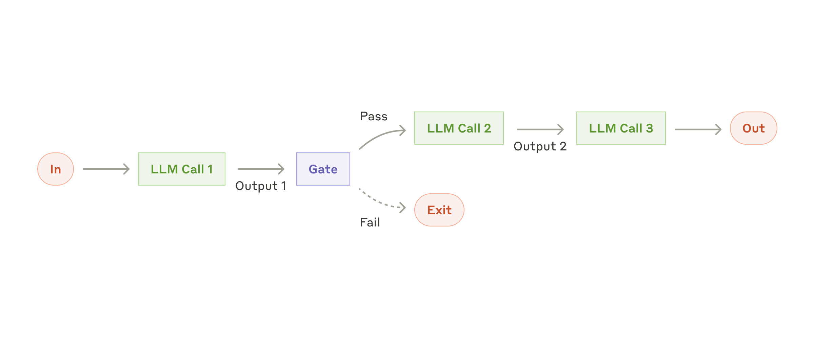
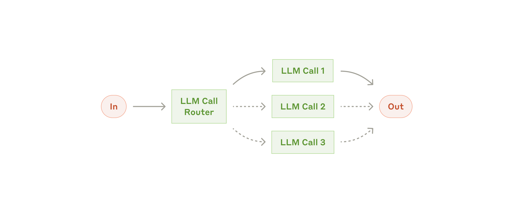
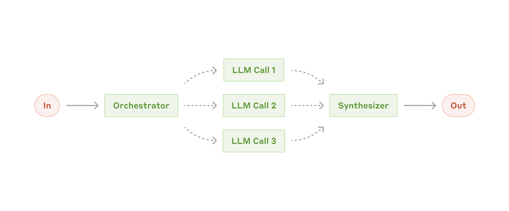

# 构建高效的 AI Agent

> 原文：[Building effective agents](https://www.anthropic.com/engineering/building-effective-agents)
> 作者：Anthropic
> 发布时间：2024 年 12 月 19 日

---

在过去的一年里，我们与数十个跨行业的团队合作，帮助他们构建大语言模型（LLM）Agent。我们发现，最成功的实现从来不是使用复杂的框架或专门的库，而是采用简单、可组合的模式。

在本文中，我们将分享从客户合作以及自身构建 Agent 过程中学到的经验，并为开发者提供构建高效 Agent 的实用建议。

## 什么是 Agent？

"Agent"可以有多种定义方式。一些客户将 Agent 定义为完全自主的系统，能够长期独立运行，使用各种工具完成复杂任务。另一些人则用这个词来描述更具规定性的实现，遵循预定义的工作流程。在 Anthropic，我们将所有这些变体归类为 **Agent 系统**，但在架构上区分了**工作流（Workflows）**和**Agent**：

- **工作流**：是通过预定义代码路径来编排 LLM 和工具的系统。
- **Agent**：则是 LLM 动态地指导自身流程和工具使用的系统，保持对任务完成方式的控制。

下面，我们将详细探讨这两种 Agent 系统。在附录 1（"实践中的 Agent"）中，我们将描述客户发现这类系统特别有价值的两个领域。

## 何时（以及何时不）使用 Agent

在构建 LLM 应用时，我们建议找到尽可能简单的解决方案，仅在需要时才增加复杂度。这可能意味着根本不需要构建 Agent 系统。Agent 系统通常以延迟和成本为代价换取更好的任务性能，你需要权衡这种取舍是否合理。

当确实需要更复杂的方案时，工作流为明确定义的任务提供了可预测性和一致性；而 Agent 则是在需要大规模灵活性和模型驱动决策时的更好选择。然而，对于许多应用来说，优化单次 LLM 调用——配合检索和上下文示例——通常就足够了。

## 何时以及如何使用框架

有许多框架可以简化 Agent 系统的实现，包括：

- [Claude Agent SDK](https://platform.claude.com/docs/en/agent-sdk/overview)
- [AWS 的 Strands Agents SDK](https://strandsagents.com/latest/)
- [Rivet](https://rivet.ironcladapp.com/)——一个拖放式 GUI LLM 工作流构建工具
- [Vellum](https://www.vellum.ai/)——另一个用于构建和测试复杂工作流的 GUI 工具

这些框架通过简化底层任务（如调用 LLM、定义和解析工具、链式调用）让你快速上手。然而，它们通常会创建额外的抽象层，掩盖底层的提示词和响应，使调试变得更加困难。它们还可能诱使你增加不必要的复杂度。

我们建议开发者直接使用 LLM API 开始：许多模式只需几行代码就能实现。如果确实使用框架，请确保理解底层代码。对底层机制的误解是客户出错的常见原因。

示例实现请参见我们的 [cookbook](https://platform.claude.com/cookbook/patterns-agents-basic-workflows)。

## 构建模块、工作流与 Agent

在本节中，我们将探讨在生产环境中常见的 Agent 系统模式。我们从基础构建模块——增强型 LLM——开始，逐步增加复杂度，从简单的组合式工作流到自主 Agent。

### 构建模块：增强型 LLM

Agent 系统的基本构建模块是经过增强的 LLM，这些增强包括检索、工具和记忆。我们当前的模型可以主动使用这些能力——生成自己的搜索查询、选择合适的工具、判断需要保留哪些信息。


我们在实现中推荐两种关键的增强方式：

1. **检索增强生成（RAG）**：将外部知识库中的相关文档注入到 LLM 的上下文中，使模型能够基于最新、最相关的信息进行回答。
2. **工具使用**：让 LLM 能够调用外部 API、执行代码、查询数据库等，扩展模型的能力边界。

### 工作流模式

#### 1. 提示链（Prompt Chaining）

将任务分解为一系列步骤，每个步骤的输出作为下一步的输入。适合那些可以清晰拆分为子任务的工作。



```python
# 提示链示例
def execute_chain(input_text):
    # 步骤 1：生成大纲
    outline = llm_call(f"为以下主题生成文章大纲：{input_text}")
  
    # 步骤 2：基于大纲撰写内容
    draft = llm_call(f"根据以下大纲撰写文章：{outline}")
  
    # 步骤 3：审阅和润色
    final = llm_call(f"审阅并润色以下文章：{draft}")
  
    return final
```

**适用场景**：

- 任务可以清晰地分解为固定步骤
- 每个步骤可以独立验证
- 需要高度可预测的输出

#### 2. 路由（Routing）

根据输入的特征将其导向不同的处理路径。适合处理不同类型输入的系统。



```python
# 路由示例
def route_input(user_query):
    # 分类输入类型
    category = llm_call(f"将以下查询分类为（技术/计费/一般）：{user_query}")
  
    if category == "技术":
        return technical_support_chain(user_query)
    elif category == "计费":
        return billing_chain(user_query)
    else:
        return general_chain(user_query)
```

**适用场景**：

- 输入有明显的类别区分
- 不同类别需要不同的处理逻辑
- 每个分支的处理相对独立

#### 3. 并行化（Parallelization）

同时执行多个 LLM 调用，然后聚合结果。有两种主要形式：


- **扇出（Fan-out）**：同一任务交给多个模型并行处理，取最佳结果
- **投票（Voting）**：多个模型处理同一任务，通过投票机制确定最终输出

```python
# 并行化示例：投票
def parallel_vote(question, num_votes=3):
    responses = []
    for _ in range(num_votes):
        # 并行执行多个 LLM 调用
        responses.append(llm_call_async(question))
  
    # 等待所有完成并聚合
    results = await asyncio.gather(*responses)
  
    # 通过投票选择最佳答案
    final = vote_on_results(results)
    return final
```

**适用场景**：

- 任务可以并行处理
- 需要高可靠性（通过冗余验证）
- 子任务之间没有依赖关系

#### 4. 编排器-工作者（Orchestrator-Workers）

一个中央 LLM（编排器）动态地将任务分配给多个子 Agent（工作者），并综合它们的输出。



```python
# 编排器-工作者模式
def orchestrator_pattern(complex_task):
    # 编排器分析任务并制定计划
    plan = orchestrator_llm(f"分析以下复杂任务并分解为子任务：{complex_task}")
  
    # 动态分配子任务给工作者
    sub_results = []
    for subtask in plan.subtasks:
        result = worker_llm(f"执行以下子任务：{subtask}")
        sub_results.append(result)
  
    # 编排器综合结果
    final_result = orchestrator_llm(
        f"综合以下子任务的结果完成最终输出：{sub_results}"
    )
    return final_result
```

**适用场景**：

- 复杂任务无法预定义固定步骤
- 子任务数量和类型因输入而异
- 需要灵活的任务分解和分配

#### 5. 评估器-优化器（Evaluator-Optimizer）

一个 LLM 生成输出，另一个 LLM 评估并提供反馈，循环迭代直到满足标准。


```python
# 评估器-优化器模式
def evaluator_optimizer(task, max_iterations=5):
    draft = generator_llm(f"针对以下任务生成解决方案：{task}")
  
    for i in range(max_iterations):
        # 评估器检查质量
        feedback = evaluator_llm(f"评估以下解决方案的质量并提供改进建议：{draft}")
      
        if feedback.is_satisfactory:
            return draft
      
        # 根据反馈优化
        draft = generator_llm(f"根据以下反馈改进解决方案：{feedback}")
  
    return draft
```

**适用场景**：

- 有明确的评估标准
- 迭代改进能带来显著提升
- 需要高质量的最终输出

### 自主 Agent

当工作流模式的确定性不足以应对复杂、开放式的任务时，自主 Agent 模式更为合适。Agent 的核心特征是：


1. **自主规划**：Agent 能够自行制定和执行计划
2. **工具选择**：动态选择和使用合适的工具
3. **环境交互**：与环境持续交互，根据反馈调整行为
4. **记忆管理**：维护短期和长期记忆，支持多轮交互

```python
# 自主 Agent 简化的主循环
class AutonomousAgent:
    def __init__(self, tools, system_prompt):
        self.tools = tools
        self.system_prompt = system_prompt
        self.memory = []
  
    async def run(self, task):
        self.memory.append({"role": "user", "content": task})
      
        while True:
            # 1. 思考：LLM 决定下一步做什么
            thought = await self.llm_think(self.memory)
          
            # 2. 行动：执行选择的行动
            if thought.action == "final_answer":
                return thought.content
          
            result = await self.execute_tool(thought.action, thought.args)
          
            # 3. 观察：将结果加入记忆
            self.memory.append({
                "role": "assistant",
                "content": f"行动：{thought.action}，结果：{result}"
            })
```

**适用场景**：

- 任务目标明确但路径不固定
- 需要与外部环境持续交互
- 问题复杂度高，无法预先穷举所有分支

## 常见陷阱与最佳实践

### 陷阱

1. **过度工程化**：为简单任务构建了过于复杂的 Agent 系统
2. **忽视基础**：连基础的 LLM 调用都还没优化好就开始构建 Agent
3. **框架依赖**：不理解底层机制就使用框架，导致调试困难
4. **缺乏评估**：没有建立充分的评估体系就上线

### 最佳实践

1. **从简单开始**：始终从最简单的方案开始，仅在必要时增加复杂度
2. **迭代优化**：逐步增加能力，每次变化都进行评估
3. **工具设计至关重要**：花时间精心设计工具接口，使其不易出错
4. **保持可观测性**：确保能够跟踪和调试 Agent 的决策过程
5. **充分测试**：在各种边缘情况下测试 Agent 的行为

## 工具设计原则

工具是 Agent 与外部世界交互的接口，好的工具设计至关重要：

1. **接口要清晰**：每个工具应该有明确的用途和参数
2. **错误要友好**：工具应该返回有意义的错误信息
3. **防错设计（Poka-yoke）**：设计工具参数使其难以误用
4. **充分测试**：用大量示例测试模型如何使用你的工具

> **案例**：在构建 SWE-bench Agent 时，我们发现模型在使用相对路径的工具时经常出错——当 Agent 离开根目录后，相对路径解析就会出问题。我们修复的方式是将工具改为要求绝对路径，之后模型再未出过这类错误。

## 结论

构建高效的 Agent 系统的关键不是选择最复杂的框架，而是：

1. **理解基础**：扎实理解 LLM 的能力和局限
2. **简单起步**：从最简单的模式开始，逐步演进
3. **精心设计工具**：工具是 Agent 能力的边界，好的工具设计至关重要
4. **充分评估**：建立完善的评估体系，用数据指导决策

最成功的 Agent 实现往往是最简单的那些——它们使用清晰、可组合的模式，而不是复杂的抽象层。

---

## 附录 1：实践中的 Agent

客户发现 Agent 系统特别有价值的两个领域：

### 客户支持

Agent 可以在客户支持场景中处理工单分类、知识库检索、常见问题回答等工作，将复杂问题无缝升级给人工客服。

### 代码生成与维护

Agent 可以在代码库中自主导航，理解代码结构，执行修改、测试和调试等任务。SWE-bench 等基准测试已经展示了 Agent 在代码任务上的潜力。

---

## 附录 2：资源推荐

- [Anthropic 的 Agent 模式 Cookbook](https://platform.claude.com/cookbook/patterns-agents-basic-workflows)
- [Claude Agent SDK](https://platform.claude.com/docs/en/agent-sdk/overview)
- [Claude](https://claude.ai/) - 亲自体验先进的 AI Agent

---

*本文翻译自 Anthropic 工程博客 [Building effective agents](https://www.anthropic.com/engineering/building-effective-agents)，版权归 Anthropic 所有。*
