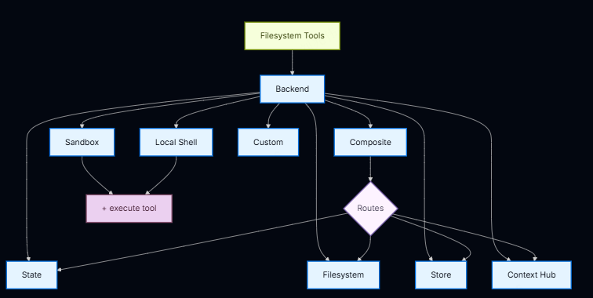

# 后端（Backends）

> 为 Deep Agent 选择并配置文件系统后端。你可以指定不同后端的路由、实现虚拟文件系统以及强制执行策略。

---

Deep Agent 通过 `ls`、`read_file`、`write_file`、`edit_file`、`glob` 和 `grep` 等工具向 Agent 暴露文件系统接口。这些工具通过可插拔的后端（Backend）运行。

`read_file` 工具在所有后端中都原生支持图片文件（`.png`、`.jpg`、`.jpeg`、`.gif`、`.webp`），以多模态内容块的形式返回。

沙箱（Sandbox）和 `LocalShellBackend` 还额外提供 `execute` 工具。

本页说明如何：

- **选择后端**
- **将不同路径路由到不同后端**
- **实现你自己的虚拟文件系统**（例如 S3 或 Postgres）
- **设置文件系统访问权限**
- **遵循后端协议**
- **从旧版后端工厂迁移**

---

## 快速入门

以下是一些预构建的文件系统后端，你可以快速用于你的 Deep Agent：

| 内置后端                                | 代码                                                                                                                                               | 描述                                                                                                                           |
| --------------------------------------- | -------------------------------------------------------------------------------------------------------------------------------------------------- | ------------------------------------------------------------------------------------------------------------------------------ |
| **默认**                          | `agent = create_deep_agent(model="google_genai:gemini-3.1-pro-preview")`                                                                         | 线程作用域。Agent 的默认文件系统后端存储在 LangGraph 状态中。文件在同一线程的多次对话中持久化（通过检查点），不在线程间共享。  |
| **本地文件系统持久化**            | `agent = create_deep_agent(model="google_genai:gemini-3.1-pro-preview", backend=FilesystemBackend(root_dir="/Users/nh/Desktop/"))`               | 赋予 Deep Agent 对你本地机器文件系统的访问权限。你可以指定 Agent 可访问的根目录。注意：提供的 `root_dir` 必须是绝对路径。    |
| **持久化存储（LangGraph Store）** | `agent = create_deep_agent(model="google_genai:gemini-3.1-pro-preview", backend=StoreBackend())`                                                 | 赋予 Agent 跨线程持久化的长期存储能力。适合存储长期记忆或跨多次执行都适用的指令。                                              |
| **Context Hub**                   | `agent = create_deep_agent(model="google_genai:gemini-3.1-pro-preview", backend=ContextHubBackend("my-agent"))`                                  | 将文件持久化存储在 LangSmith Hub 仓库中，无需额外配置独立的 LangGraph Store。                                                  |
| **沙箱（Sandbox）**               | `agent = create_deep_agent(model="google_genai:gemini-3.1-pro-preview", backend=sandbox)`                                                        | 在隔离环境中执行代码。沙箱提供文件系统工具以及用于运行 shell 命令的 `execute` 工具。可选择 Modal、Daytona、Deno 或本地 VFS。 |
| **本地 Shell**                    | `agent = create_deep_agent(model="google_genai:gemini-3.1-pro-preview", backend=LocalShellBackend(root_dir=".", env={"PATH": "/usr/bin:/bin"}))` | 直接在宿主机上执行文件系统和 Shell 操作。无隔离——仅在受控的开发环境中使用。请参阅下面的安全说明。                            |
| **复合（Composite）**             | `agent = create_deep_agent(...)` 见下方复合路由示例                                                                                              | 默认线程作用域，`/memories/` 跨线程持久化。复合后端具有最大的灵活性。你可以指定文件系统中的不同路由指向不同的后端。          |



## 内置后端

### StateBackend

```python
from deepagents import create_deep_agent
from deepagents.backends import StateBackend

# 默认情况下提供 StateBackend
agent = create_deep_agent(
    model="google_genai:gemini-3.1-pro-preview"
)

# 底层实现如下
agent2 = create_deep_agent(
    model="google_genai:gemini-3.1-pro-preview",
    backend=StateBackend(),
)
```

**工作原理：**

- 通过 `StateBackend` 将文件存储在当前线程的 LangGraph Agent 状态中
- 通过检查点在同一线程的多次 Agent 对话之间持久化
- 文件不在线程间共享
- 设计为在图（graph）内部使用。在图运行之外调用后端方法（例如 `state_backend.upload_files(...)`）不会生效，直到图执行

**最佳用途：**

- Agent 书写中间结果的草稿板
- 自动驱逐大型工具输出，Agent 之后可以逐段读回

> **注意**：此后端在监督 Agent 和子 Agent 之间共享。子 Agent 写入的任何文件在子 Agent 执行完成后仍会保留在 LangGraph Agent 状态中，监督 Agent 和其他子 Agent 可以继续访问这些文件。

---

### FilesystemBackend（本地磁盘）

FilesystemBackend 在可配置的根目录下读写真实文件。此后端授予 Agent 直接的文件系统读/写权限。请谨慎使用，仅限合适的环境。

**适当的使用场景：**

- 本地开发 CLI（编码助手、开发工具）
- CI/CD 流水线（请参阅下面的安全说明）

**不适当的使用场景：**

- Web 服务器或 HTTP API——应使用 `StateBackend`、`StoreBackend` 或沙箱后端

**安全风险：**

- Agent 可以读取任何可访问的文件，包括密钥（API 密钥、凭据、`.env` 文件）
- 结合网络工具，密钥可能通过 SSRF 攻击被泄露
- 文件修改是永久性的且不可逆

**建议的安全措施：**

- 启用人工介入（HITL）中间件来审查敏感操作
- 将密钥排除在可访问的文件系统路径之外（尤其是在 CI/CD 中）
- 对于需要文件系统交互的生产环境，使用沙箱后端
- 始终将 `virtual_mode=True` 与 `root_dir` 同时使用，以启用基于路径的访问限制（阻止 `..`、`~` 和 `root_dir` 之外的绝对路径）
- 注意：默认值 `virtual_mode=False` 即使设置了 `root_dir` 也不提供任何安全性

```python
from deepagents import create_deep_agent
from deepagents.backends import FilesystemBackend

agent = create_deep_agent(
    model="google_genai:gemini-3.1-pro-preview",
    backend=FilesystemBackend(
        root_dir=".",
        virtual_mode=True
    ),
)
```

**工作原理：**

- 在可配置的 `root_dir` 下读写真实文件
- 可选地设置 `virtual_mode=True` 以在 `root_dir` 下沙箱化和规范化路径
- 使用安全的路径解析，尽可能防止不安全的符号链接遍历
- 可以使用 `ripgrep` 实现快速 `grep`

**最佳用途：**

- 本地机器上的项目
- CI 沙箱
- 挂载的持久化卷

---

### StoreBackend（LangGraph Store）

StoreBackend 通过配置的 LangGraph Store 持久化文件。文件存储在 `/` 命名空间下，并在同一 Store 内的所有线程之间共享。Store 必须在 `create_deep_agent` 中提供，或由平台预配置。

```python
from deepagents import create_deep_agent
from deepagents.backends import StoreBackend
from langgraph.store.memory import InMemoryStore

agent = create_deep_agent(
    model="google_genai:gemini-3.1-pro-preview",
    backend=StoreBackend(),
    store=InMemoryStore(),
)
```

**工作原理：**

- 文件持久化到 Store 后端——跨线程持久化，与检查点机制无关
- 文件在 Agent 的所有实例和线程之间共享
- 文件在 Agent 执行完成后仍然存在
- 适用于长期记忆

**命名空间工厂：**
`StoreBackend` 使用命名空间工厂来确定文件存储的命名空间。默认工厂使用根命名空间，意味着所有线程共享相同的文件集。你可以提供自定义工厂将文件隔离到例如每个用户的命名空间中：

```python
from deepagents.backends import StoreBackend

def user_scoped_namespace_factory(runtime):
    user_id = runtime.context.get("user_id", "default")
    return ("agents", user_id)

backend = StoreBackend(
    namespace_factory=user_scoped_namespace_factory,
)
```

当未提供 `namespace_factory` 时，StoreBackend 将文件存储在根命名空间下，所有线程都可访问。

**最佳用途：**

- 长期记忆（偏好、积累的知识）
- 需要跨所有会话持久化的共享配置
- 需要在 Agent 重启后保留的数据

---

### ContextHubBackend

ContextHubBackend 使用 LangSmith Hub 仓库进行持久化存储。你只需提供仓库名称，无需额外配置独立的 LangGraph Store。

```python
from deepagents import create_deep_agent
from deepagents.backends import ContextHubBackend

agent = create_deep_agent(
    model="google_genai:gemini-3.1-pro-preview",
    backend=ContextHubBackend("my-agent"),
)
```

**工作原理：**

- 文件持久化存储到 LangSmith Hub 仓库
- 无需配置单独的 LangGraph Store
- 适合在团队或环境之间共享 Agent 状态

**最佳用途：**

- 需要持久化但不想管理额外存储基础设施的场景
- 快速原型开发

---

### 沙箱后端（Sandbox Backends）

沙箱后端在隔离环境中执行代码，提供文件系统工具和 `execute` 工具用于运行 shell 命令。

```python
from deepagents import create_deep_agent
from deepagents.backends.sandbox import create_sandbox

sandbox = create_sandbox("modal")  # 或 "daytona", "deno", "local"

agent = create_deep_agent(
    model="google_genai:gemini-3.1-pro-preview",
    backend=sandbox,
)
```

**支持的沙箱类型：**

| 沙箱               | 描述                                       |
| ------------------ | ------------------------------------------ |
| **Modal**    | 远程沙箱，在 Modal 基础设施上运行隔离代码  |
| **Daytona**  | 远程沙箱，使用 Daytona 环境                |
| **Deno**     | 基于 Deno 的沙箱                           |
| **本地 VFS** | 本地虚拟文件系统沙箱，提供隔离但不远程执行 |

**最佳用途：**

- 需要安全代码执行的生产环境
- 运行不受信任的代码
- 需要环境隔离的场景

---

### LocalShellBackend（本地 Shell）

LocalShellBackend 直接在宿主机上提供文件系统和 Shell 执行。**无隔离**——仅在受控的开发环境中使用。

```python
from deepagents import create_deep_agent
from deepagents.backends import LocalShellBackend

agent = create_deep_agent(
    model="google_genai:gemini-3.1-pro-preview",
    backend=LocalShellBackend(
        root_dir=".",
        env={"PATH": "/usr/bin:/bin"},
    ),
)
```

**工作原理：**

- 在宿主机上直接执行命令
- 提供文件系统工具 + `execute` 工具
- 支持自定义环境变量
- 无沙箱或隔离机制

**安全说明：**

- 仅用于本地开发和调试
- Agent 可访问宿主机上的所有文件（受 `root_dir` 限制）
- 不要在生产环境或面向用户的应用程序中使用

---

### CompositeBackend（复合/路由后端）

CompositeBackend 是最大灵活性的后端。你可以指定文件系统中不同路由指向不同后端。例如：默认线程作用域，`/memories/` 跨线程持久化。

```python
from deepagents import create_deep_agent
from deepagents.backends import CompositeBackend, StateBackend, FilesystemBackend

agent = create_deep_agent(
    model="google_genai:gemini-3.1-pro-preview",
    backend=CompositeBackend(
        default=StateBackend(),
        routes={
            "/memories/": FilesystemBackend(
                root_dir="/deepagents/myagent",
                virtual_mode=True,
            ),
        },
    ),
)
```

**行为示例：**

- `/workspace/plan.md` → StateBackend（线程作用域）
- `/memories/agent.md` → FilesystemBackend（在 `/deepagents/myagent` 下）
- `ls`、`glob`、`grep` 聚合结果并显示原始路径前缀

**注意：**

- 更长的前缀优先（例如，路由 `"/memories/projects/"` 可以覆盖 `"/memories/"`）
- 对于 StoreBackend 路由，确保通过 `create_deep_agent(model=..., store=...)` 提供 store，或由平台预配置

---

## 指定后端

将后端实例传递给 `create_deep_agent(model=..., backend=...)`。文件系统中间件的所有工具都使用该后端。

后端必须实现 `BackendProtocol`（例如 `StateBackend()`、`FilesystemBackend(root_dir=".")`、`StoreBackend()`、`ContextHubBackend("my-agent")`）。

如果省略，默认是 `StateBackend()`。

---

## 路由到不同后端

将命名空间的不同部分路由到不同后端。通常用于将 `/memories/*` 跨线程持久化，同时其他内容保持线程作用域。

示例请见上方 [CompositeBackend](#compositebackend复合路由后端) 部分。

---

## 使用虚拟文件系统

构建自定义后端，将远程或数据库文件系统（例如 S3 或 Postgres）映射到工具命名空间中。

**设计指南：**

- 路径是绝对路径（`/x/y.txt`）
- 决定如何将它们映射到你的存储键/行
- 高效实现 `ls` 和 `glob`（尽可能使用服务端过滤，否则本地过滤）
- 对于外部持久化（S3、Postgres 等），在写/编辑结果中返回 `files_update=None`——只有内存中的状态后端需要返回 `files_update` 字典
- 使用 `ls` 和 `glob` 作为方法名
- 返回结构化结果类型，对于缺失文件或无效模式使用 `error` 字段（不要抛出异常）

**S3 风格示例：**

```python
from deepagents.backends.protocol import (
    BackendProtocol,
    WriteResult,
    EditResult,
    LsResult,
    ReadResult,
    GrepResult,
    GlobResult,
)

class S3Backend(BackendProtocol):
    def __init__(self, bucket: str, prefix: str = ""):
        self.bucket = bucket
        self.prefix = prefix.rstrip("/")

    def _key(self, path: str) -> str:
        return f"{self.prefix}{path}"

    def ls(self, path: str) -> LsResult:
        # 列出 _key(path) 下的对象；构建 FileInfo 条目（path, size, modified_at）
        ...

    def read(self, file_path: str, offset: int = 0, limit: int = 2000) -> ReadResult:
        # 获取对象；返回 ReadResult(file_data=...) 或 ReadResult(error=...)
        ...

    def grep(self, pattern: str, path: str | None = None, glob: str | None = None) -> GrepResult:
        # 可选地服务端过滤；否则列出并扫描内容
        ...

    def glob(self, pattern: str, path: str = "/") -> GlobResult:
        # 相对于路径应用 glob 匹配键
        ...

    def write(self, file_path: str, content: str) -> WriteResult:
        # 将对象上传到 S3
        ...

    def edit(self, file_path: str, old_string: str, new_string: str) -> EditResult:
        # 读取、替换、写回
        ...
```

---

## 权限（Permissions）

后端支持设置文件系统访问权限。你可以控制 Agent 对文件系统中特定路径的读写能力。

> 具体权限 API 和使用示例，请参阅 LangChain 官方参考文档。

**建议：**

- 对敏感路径设置只读权限
- 使用权限限制 Agent 可写入的目录
- 在 `FilesystemBackend` 中使用 `virtual_mode=True` 启用基于路径的访问限制

---

## 添加策略钩子（Policy Hooks）

你可以为后端添加策略钩子，在文件系统操作前后执行自定义逻辑。

> 策略钩子允许你实现自定义的访问控制、审计日志或操作验证逻辑。

---

## 从后端工厂迁移

如果你的代码使用旧版后端工厂（`from deepagents.backends import create_backend`），需要迁移到新的后端实例 API。

### 变更内容

旧的 `create_backend` 工厂函数已在 `deepagents.backends` 中移除。现在的后端是实例化的类（例如 `StateBackend()`、`FilesystemBackend(...)`），直接传递给 `create_deep_agent` 的 `backend` 参数。

### 已弃用的 API

以下 API 已被移除或弃用：

- `create_backend("state", ...)` → 使用 `StateBackend()`
- `create_backend("filesystem", ...)` → 使用 `FilesystemBackend(...)`
- `BackendContext` 类 → 使用 `BackendProtocol`（参数名称和类型已更改）

### 迁移示例

**旧代码：**

```python
from deepagents.backends import create_backend

backend = create_backend("state")
agent = create_deep_agent(model="...", backend=backend)
```

**新代码：**

```python
from deepagents.backends import StateBackend

backend = StateBackend()
agent = create_deep_agent(model="...", backend=backend)
```

### 从 BackendContext 迁移

旧版 `BackendContext` 已被 `BackendProtocol` 替代。相关参数名称和类型签名已更改。请参阅下面的协议参考了解新接口。

---

## 协议参考（Protocol Reference）

所有后端必须实现 `BackendProtocol`。协议定义如下方法：

| 方法      | 签名                                                                     | 描述                 |
| --------- | ------------------------------------------------------------------------ | -------------------- |
| `ls`    | `ls(path: str) -> LsResult`                                            | 列出目录内容         |
| `read`  | `read(file_path: str, offset: int, limit: int) -> ReadResult`          | 读取文件内容         |
| `write` | `write(file_path: str, content: str) -> WriteResult`                   | 写入文件             |
| `edit`  | `edit(file_path: str, old_string: str, new_string: str) -> EditResult` | 编辑文件（查找替换） |
| `glob`  | `glob(pattern: str, path: str) -> GlobResult`                          | 通配符搜索文件       |
| `grep`  | `grep(pattern: str, path: str, glob: str) -> GrepResult`               | 在文件内容中搜索模式 |

每个结果类型包含一个 `error` 字段，用于报告缺失文件或无效模式（不要抛出异常）。

完整类型导入：

```python
from deepagents.backends.protocol import (
    BackendProtocol,
    WriteResult,
    EditResult,
    LsResult,
    ReadResult,
    GrepResult,
    GlobResult,
)
```

---

> **原文**：[https://docs.langchain.com/oss/python/deepagents/backends](https://docs.langchain.com/oss/python/deepagents/backends)
>
> **许可**：本文档基于 LangChain 官方文档翻译，仅供学习参考。
