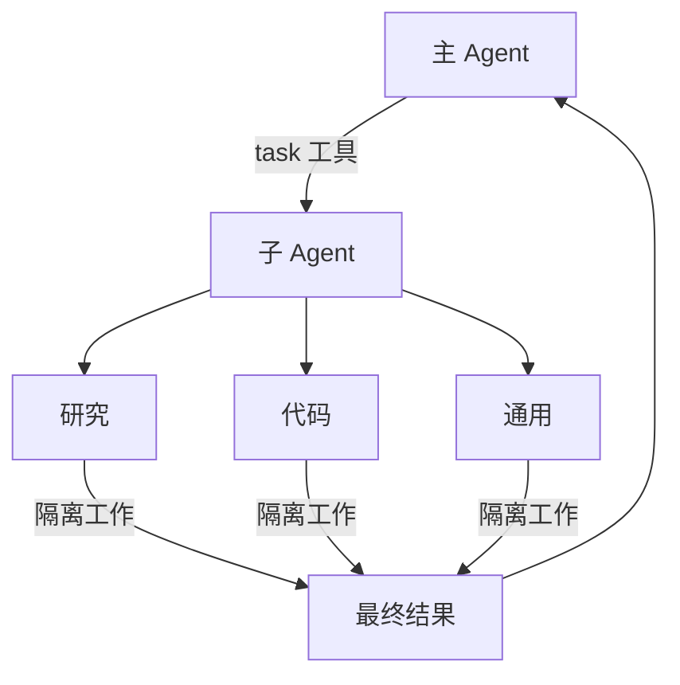

# 子 Agent（Subagents）

> 了解如何使用子 Agent 委派工作并保持上下文整洁

深度 Agent（Deep Agent）可以创建子 Agent（Subagents）来委派工作。您可以在 `subagents` 参数中指定自定义子 Agent。子 Agent 对于[上下文隔离（context quarantine）](https://www.dbreunig.com/2025/06/26/how-to-fix-your-context.html#context-quarantine)（保持主 Agent 上下文整洁）以及提供专业化指令非常有用。

本页面涵盖**同步（synchronous）**子 Agent，即主 Agent 阻塞等待子 Agent 完成。对于长时间运行的任务、并行工作流或需要运行时中途控制和取消的场景，请参见[异步子 Agent（Async subagents）](/oss/python/deepagents/async-subagents)。



## 为什么使用子 Agent？（Why use subagents?）

子 Agent 解决了**上下文膨胀问题（context bloat problem）**。当 Agent 使用输出量大的工具（网络搜索、文件读取、数据库查询）时，中间结果会迅速填满上下文窗口。子 Agent 隔离了这些细节工作——主 Agent 只接收最终结果，而不是产生该结果的数十次工具调用。

**何时使用子 Agent：**

- ✅ 会使主智能体上下文混乱的多步骤任务
- ✅ 需要自定义指令或工具的专门领域
- ✅ 需要不同模型能力的任务
- ✅ 希望保持主 Agent 专注于高层协调时

**何时不要使用子 Agent：**

- ❌ 简单的单步任务
- ❌ 需要保持中间上下文时
- ❌ 开销超过收益时

## 配置（Configuration）

`subagents` 应是一个字典列表或 `CompiledSubAgent` 对象列表。有两种类型：

### 默认子 Agent（Default subagent）

Deep Agents 自动添加一个同步的 `general-purpose` 子 Agent，除非您已经提供了同名的同步子 Agent。

`general-purpose` 子 Agent 默认拥有文件系统工具，可以通过额外的工具/中间件进行自定义。

- 要替换它，传入您自己的名为 `general-purpose` 的子 Agent。
- 要重命名或重新提示自动添加的版本，在活动的[操控配置文件（Harness profile）](/oss/python/deepagents/profiles#harness-profiles)上设置 `general_purpose_subagent=GeneralPurposeSubagentProfile(...)`。
- 要禁用它，请参见下面的[无子 Agent 运行](#running-without-subagents)。

### 无子 Agent 运行（Running without subagents）

要运行没有 `task` 工具的 Agent，做两件事：

1. 在活动的[操控配置文件（Harness profile）](/oss/python/deepagents/profiles#harness-profiles)上设置 `general_purpose_subagent=GeneralPurposeSubagentProfile(enabled=False)`。
2. 在 `create_deep_agent` 上不通过 `subagents=` 传入同步子 Agent。

只有当至少存在一个同步子 Agent 时，Deep Agents 才会附加 `SubAgentMiddleware`（以及 `task` 工具）。既没有默认子 Agent 也没有调用者提供的子 Agent 时，Agent 无委派能力运行。

异步子 Agent 不受影响——它们通过自己的中间件和工具流动，详见[异步子 Agent（Async subagents）](/oss/python/deepagents/async-subagents)。

<Tip>
    不要在这里使用 `excluded_middleware`——`SubAgentMiddleware` 是必需的基础设施，列出它会引发 `ValueError`。`general_purpose_subagent.enabled = False` 是受支持的路径。
</Tip>

## 自定义子 Agent（Custom subagents）

您可以使用 `subagents` 参数定义具有特定工具的专门化子 Agent。例如作为代码审查员、网络研究员或测试运行器。

对于大多数用例，将子 Agent 定义为[子 Agent 字典](#subagent-dictionary-based)。对于复杂工作流，使用 [`CompiledSubAgent`](#compiledsubagent)：

### SubAgent（基于字典）

定义与 @[`SubAgent`] 规范匹配的字典，包含以下字段：

:::python

| 字段                | 类型                           | 描述                                                                                                                                                                                                                                                                                                                                                                                                              |
| ------------------- | ------------------------------ | ----------------------------------------------------------------------------------------------------------------------------------------------------------------------------------------------------------------------------------------------------------------------------------------------------------------------------------------------------------------------------------------------------------------- |
| `name`            | `str`                        | 必需。子 Agent 的唯一标识符。主 Agent 在调用 `task()` 工具时使用此名称。子 Agent 名称成为 `AIMessage` 和流式传输的元数据，有助于区分不同的 Agent。                                                                                                                                                                                                                                                            |
| `description`     | `str`                        | 必需。描述此子 Agent 的职责。要具体且面向行动。主 Agent 使用此描述来决定何时委派。                                                                                                                                                                                                                                                                                                                                |
| `system_prompt`   | `str`                        | 必需。子 Agent 的指令。自定义子 Agent 必须定义自己的指令。包括工具使用指南和输出格式要求。`<br></br>`不从主 Agent 继承。                                                                                                                                                                                                                                                                                        |
| `tools`           | `list[Callable]`             | 可选。子 Agent 可使用的工具。保持最小化，只包含必要的工具。`<br></br>`默认从主 Agent 继承。指定时，完全覆盖继承的工具。                                                                                                                                                                                                                                                                                         |
| `model`           | `str` \| `BaseChatModel`   | 可选。覆盖主 Agent 的模型。省略则使用主 Agent 的模型。`<br></br>`默认从主 Agent 继承。您可以传入模型标识字符串如 `'openai:gpt-5.4'`（使用 `'provider:model'` 格式）或 LangChain 聊天模型对象（`init_chat_model("gpt-5.4")` 或 `ChatOpenAI(model="gpt-5.4")`）。                                                                                                                                         |
| `middleware`      | `list[Middleware]`           | 可选。用于自定义行为、日志记录或速率限制的额外中间件。`<br></br>`不从主 Agent 继承。                                                                                                                                                                                                                                                                                                                            |
| `interrupt_on`    | `dict[str, bool]`            | 可选。为特定工具配置[人工介入（human-in-the-loop）](/oss/python/deepagents/human-in-the-loop)。子 Agent 的值覆盖主 Agent。需要检查点器（checkpointer）。`<br></br>`默认从主 Agent 继承。子 Agent 的值覆盖默认值。                                                                                                                                                                                                  |
| `skills`          | `list[str]`                  | 可选。[技能（Skills）](/oss/python/deepagents/skills)源路径。指定后，子 Agent 将从这些目录加载技能（例如 `["/skills/research/", "/skills/web-search/"]`）。这允许子 Agent 拥有与主 Agent 不同的技能集。`<br></br>`不从主 Agent 继承。只有通用子 Agent 继承主 Agent 的技能。当子 Agent 拥有技能时，它运行自己独立的 @[`SkillsMiddleware`] 实例。技能状态完全隔离——子 Agent 加载的技能对父级不可见，反之亦然。 |
| `response_format` | `ResponseFormat`             | 可选。[结构化输出（Structured output）](/oss/langchain/structured-output)模式，用于子 Agent。设置后，父级接收子 Agent 的结果为 JSON 而非自由格式文本。接受 Pydantic 模型、`ToolStrategy(...)`、`ProviderStrategy(...)` 或原始模式类型。参见[结构化输出](#structured-output)。                                                                                                                                       |
| `permissions`     | `list[FilesystemPermission]` | 可选。子 Agent 的[文件系统权限规则](/oss/python/deepagents/permissions)。设置后，**完全替换**父 Agent 的权限。`<br></br>`默认从主 Agent 继承。                                                                                                                                                                                                                                                               |

:::

:::js

| 字段               | 类型                         | 描述                                                                                                                                                                                                                                                                                                                                                                                                              |
| ------------------ | ---------------------------- | ----------------------------------------------------------------------------------------------------------------------------------------------------------------------------------------------------------------------------------------------------------------------------------------------------------------------------------------------------------------------------------------------------------------- |
| `name`           | `str`                      | 必需。子 Agent 的唯一标识符。主 Agent 在调用 `task()` 工具时使用此名称。子 Agent 名称成为 `AIMessage` 和流式传输的元数据，有助于区分不同的 Agent。                                                                                                                                                                                                                                                            |
| `description`    | `str`                      | 必需。描述此子 Agent 的职责。要具体且面向行动。主 Agent 使用此描述来决定何时委派。                                                                                                                                                                                                                                                                                                                                |
| `system_prompt`  | `str`                      | 必需。子 Agent 的指令。自定义子 Agent 必须定义自己的指令。包括工具使用指南和输出格式要求。`<br></br>`不从主 Agent 继承。                                                                                                                                                                                                                                                                                        |
| `tools`          | `list[Callable]`           | 可选。子 Agent 可使用的工具。保持最小化，只包含必要的工具。`<br></br>`默认从主 Agent 继承。指定时，完全覆盖继承的工具。                                                                                                                                                                                                                                                                                         |
| `model`          | `str` \| `BaseChatModel` | 可选。覆盖主 Agent 的模型。省略则使用主 Agent 的模型。`<br></br>`默认从主 Agent 继承。您可以传入模型标识字符串如 `'openai:gpt-5.4'`（使用 `'provider:model'` 格式）或 LangChain 聊天模型对象（`await initChatModel("gpt-5.4")` 或 `new ChatOpenAI({ model: "gpt-5.4" })`）。                                                                                                                            |
| `middleware`     | `list[Middleware]`         | 可选。用于自定义行为、日志记录或速率限制的额外中间件。`<br></br>`不从主 Agent 继承。                                                                                                                                                                                                                                                                                                                            |
| `interrupt_on`   | `dict[str, bool]`          | 可选。为特定工具配置[人工介入（human-in-the-loop）](/oss/python/deepagents/human-in-the-loop)。子 Agent 的值覆盖主 Agent。需要检查点器。`<br></br>`默认从主 Agent 继承。子 Agent 的值覆盖默认值。                                                                                                                                                                                                                  |
| `skills`         | `list[str]`                | 可选。[技能（Skills）](/oss/python/deepagents/skills)源路径。指定后，子 Agent 将从这些目录加载技能（例如 `["/skills/research/", "/skills/web-search/"]`）。这允许子 Agent 拥有与主 Agent 不同的技能集。`<br></br>`不从主 Agent 继承。只有通用子 Agent 继承主 Agent 的技能。当子 Agent 拥有技能时，它运行自己独立的 @[`SkillsMiddleware`] 实例。技能状态完全隔离——子 Agent 加载的技能对父级不可见，反之亦然。 |
| `responseFormat` | `ResponseFormat`           | 可选。[结构化输出（Structured output）](/oss/langchain/structured-output)模式，用于子 Agent。设置后，父级接收子 Agent 的结果为 JSON 而非自由格式文本。接受 Zod 模式、JSON schema 对象、`toolStrategy(...)` 或 `providerStrategy(...)`。参见[结构化输出](#structured-output)。                                                                                                                                       |

:::

### CompiledSubAgent

对于复杂工作流，使用预构建的 LangGraph 图作为 @[`CompiledSubAgent`]：

| 字段            | 类型         | 描述                                                                                                      |
| --------------- | ------------ | --------------------------------------------------------------------------------------------------------- |
| `name`        | `str`      | 必需。子 Agent 的唯一标识符。子 Agent 名称成为 `AIMessage` 和流式传输的元数据，有助于区分不同的 Agent。 |
| `description` | `str`      | 必需。此子 Agent 的职责描述。                                                                             |
| `runnable`    | `Runnable` | 必需。一个已编译的 LangGraph 图（必须首先调用 `.compile()`）。                                          |

## 使用 SubAgent（Using SubAgent）

:::python

```python
from deepagents import create_deep_agent

# 定义子 Agent
subagents = [
    {
        "name": "research-agent",
        "description": "Used to research more in depth questions",
        "system_prompt": "You are a great researcher",
        "tools": [internet_search],
    },
]

agent = create_deep_agent(
    model="google_genai:gemini-3.1-pro-preview",
    subagents=subagents,
)
```

:::

:::js

```typescript
import { createDeepAgent } from "deepagents";

// 定义子 Agent
const subagents = [
  {
    name: "research-agent",
    description: "Used to research more in depth questions",
    systemPrompt: "You are a great researcher",
    tools: [internetSearch],
  },
];

const agent = await createDeepAgent({
  model: "google_genai:gemini-3.1-pro-preview",
  subagents: subagents,
});
```

:::

## 使用 CompiledSubAgent（Using CompiledSubAgent）

对于更复杂的用例，您可以使用 @[`CompiledSubAgent`] 提供自定义子 Agent。
您可以使用 LangChain 的 @[`create_agent`] 创建自定义子 Agent，或使用[图 API（graph API）](/oss/langgraph/graph-api)创建自定义 LangGraph 图。

如果您正在创建自定义 LangGraph 图，请确保该图有一个名为 `"messages"` 的状态键：

:::python

```python
from deepagents import create_deep_agent, CompiledSubAgent
from langchain.agents import create_agent

# 创建自定义 Agent 图
custom_graph = create_agent(
    model=your_model,
    tools=specialized_tools,
    prompt="You are a specialized agent for data analysis..."
)

# 用作自定义子 Agent
custom_subagent = CompiledSubAgent(
    name="data-analyzer",
    description="Specialized agent for complex data analysis tasks",
    runnable=custom_graph
)

subagents = [custom_subagent]

agent = create_deep_agent(
    model="google_genai:gemini-3.1-pro-preview",
    tools=[internet_search],
    system_prompt=research_instructions,
    subagents=subagents
)
```

:::

:::js

```typescript
import { createDeepAgent, CompiledSubAgent } from "deepagents";
import { createAgent } from "langchain";

// 创建自定义 Agent 图
const customGraph = createAgent({
  model: yourModel,
  tools: specializedTools,
  prompt: "You are a specialized agent for data analysis...",
});

// 用作自定义子 Agent
const customSubagent: CompiledSubAgent = {
  name: "data-analyzer",
  description: "Specialized agent for complex data analysis tasks",
  runnable: customGraph,
};

const subagents = [customSubagent];

const agent = createDeepAgent({
  model: "google_genai:gemini-3.1-pro-preview",
  tools: [internetSearch],
  systemPrompt: researchInstructions,
  subagents: subagents,
});
```

:::

## 流式传输（Streaming）

在流式传输追踪信息时，Agent 的名称作为 `lc_agent_name` 在元数据中可用。
在查看追踪信息时，您可以使用此元数据来区分数据来自哪个 Agent。

以下示例创建了一个名为 `main-agent` 的深度 Agent 和一个名为 `research-agent` 的子 Agent：

```python
import os
from typing import Literal
from tavily import TavilyClient
from deepagents import create_deep_agent

tavily_client = TavilyClient(api_key=os.environ["TAVILY_API_KEY"])

def internet_search(
    query: str,
    max_results: int = 5,
    topic: Literal["general", "news", "finance"] = "general",
    include_raw_content: bool = False,
):
    """Run a web search"""
    return tavily_client.search(
        query,
        max_results=max_results,
        include_raw_content=include_raw_content,
        topic=topic,
    )

research_subagent = {
    "name": "research-agent",
    "description": "Used to research more in depth questions",
    "system_prompt": "You are a great researcher",
    "tools": [internet_search],
    "model": "google_genai:gemini-3.1-pro-preview",  # Optional override, defaults to main agent model
}
subagents = [research_subagent]

agent = create_deep_agent(
    model="google_genai:gemini-3.1-pro-preview",
    subagents=subagents,
    name="main-agent"
)
```

当您提示深度 Agent 时，由子 Agent 或深度 Agent 执行的所有 Agent 运行都会在其元数据中包含 Agent 名称。
在这个例子中，名为 `"research-agent"` 的子 Agent 将在任何关联的 Agent 运行元数据中包含 `{'lc_agent_name': 'research-agent'}`：


## 结构化输出（Structured output）

子 Agent 支持[结构化输出（Structured output）](/oss/langchain/structured-output)，因此父 Agent 接收可预测、可解析的 JSON 而不是自由格式文本。

:::python

<Note>
    子 Agent 的结构化输出需要 `deepagents>=0.5.3`。
</Note>

在子 Agent 配置上传递 `response_format`。当子 Agent 完成时，其结构化响应以 JSON 序列化形式作为 `ToolMessage` 内容返回给父 Agent。该模式接受 @[`create_agent`] 支持的任何内容：Pydantic 模型、`ToolStrategy(...)`、`ProviderStrategy(...)` 或原始模式类型。

```python
from pydantic import BaseModel, Field

from deepagents import create_deep_agent


class ResearchFindings(BaseModel):
    """Structured findings from a research task."""
    summary: str = Field(description="Summary of findings")
    confidence: float = Field(description="Confidence score from 0 to 1")
    sources: list[str] = Field(description="List of source URLs")

research_subagent = {
    "name": "researcher",
    "description": "Researches topics and returns structured findings",
    "system_prompt": "Research the given topic thoroughly. Return your findings.",
    "tools": [web_search],
    "response_format": ResearchFindings,
}

agent = create_deep_agent(
    model="claude-sonnet-4-6",
    subagents=[research_subagent],
)

result = await agent.ainvoke(
    {"messages": [{"role": "user", "content": "Research recent advances in quantum computing"}]}
)

# The parent's ToolMessage contains JSON-serialized structured data:
# '{"summary": "...", "confidence": 0.87, "sources": ["https://..."]}'
```

:::

:::js

<Note>
    子 Agent 的结构化输出需要 `deepagents>=1.8.4`。
</Note>

在子 Agent 配置上传递 `responseFormat`。当子 Agent 完成时，其结构化响应以 JSON 序列化形式作为 `ToolMessage` 内容返回给父 Agent。该模式接受 `createAgent` 支持的任何内容：Zod 模式、JSON schema 对象、`toolStrategy(...)` 或 `providerStrategy(...)`。

```typescript
import { z } from "zod";
import { createDeepAgent } from "deepagents";

const ResearchFindings = z.object({
  summary: z.string().describe("Summary of findings"),
  confidence: z.number().describe("Confidence score from 0 to 1"),
  sources: z.array(z.string()).describe("List of source URLs"),
});

const researchSubagent = {
  name: "researcher",
  description: "Researches topics and returns structured findings",
  systemPrompt: "Research the given topic thoroughly. Return your findings.",
  tools: [webSearch],
  responseFormat: ResearchFindings,
};

const agent = createDeepAgent({
  model: "claude-sonnet-4-6",
  subagents: [researchSubagent],
});

const result = await agent.invoke({
  messages: [{ role: "user", content: "Research recent advances in quantum computing" }],
});

// The parent's ToolMessage contains JSON-serialized structured data:
// '{"summary": "...", "confidence": 0.87, "sources": ["https://..."]}'
```

:::

没有 `response_format` 时，父级接收子 Agent 的最后一条消息文本。有了它，父级始终获得匹配模式的合法 JSON，当父级需要以编程方式处理结果或将其传递给下游工具时非常有用。

有关模式类型和策略（工具调用 vs. 提供商原生）的完整细节，请参见[结构化输出（Structured output）](/oss/langchain/structured-output)。

## 通用子 Agent（The general-purpose subagent）

除了任何用户定义的子 Agent 之外，每个深度 Agent 始终可以访问 `general-purpose` 子 Agent。该子 Agent：

- 拥有与主 Agent 相同的系统提示词
- 可以访问所有相同的工具
- 使用相同的模型（除非被覆盖）
- 从主 Agent 继承技能（当配置了技能时）

### 覆盖通用子 Agent（Override the general-purpose subagent）

:::python
在您的 `subagents` 列表中包含一个 `name="general-purpose"` 的子 Agent 来替换默认值。使用此方法为通用子 Agent 配置不同的模型、工具或系统提示词：

```python
from deepagents import create_deep_agent

# Main agent uses Gemini; general-purpose subagent uses GPT
agent = create_deep_agent(
    model="google_genai:gemini-3.1-pro-preview",
    tools=[internet_search],
    subagents=[
        {
            "name": "general-purpose",
            "description": "General-purpose agent for research and multi-step tasks",
            "system_prompt": "You are a general-purpose assistant.",
            "tools": [internet_search],
            "model": "openai:gpt-5.4",  # Different model for delegated tasks
        },
    ],
)
```

:::

:::js
在您的 `subagents` 列表中包含一个 `name: "general-purpose"` 的子 Agent 来替换默认值。使用此方法为通用子 Agent 配置不同的模型、工具或系统提示词：

```typescript
import { createDeepAgent } from "deepagents";

// Main agent uses Gemini; general-purpose subagent uses GPT
const agent = await createDeepAgent({
  model: "google_genai:gemini-3.1-pro-preview",
  tools: [internetSearch],
  subagents: [
    {
      name: "general-purpose",
      description: "General-purpose agent for research and multi-step tasks",
      systemPrompt: "You are a general-purpose assistant.",
      tools: [internetSearch],
      model: "openai:gpt-5.4",  // Different model for delegated tasks
    },
  ],
});
```

:::

当您提供具有通用名称的子 Agent 时，不会添加默认的通用子 Agent。您的规范完全替换了它。

要完全移除内置的通用子 Agent 而不是替换它，将活动操控配置文件的通用子 Agent `enabled` 标志设置为 `False`。

### 何时使用（When to use it）

通用子 Agent 非常适合在不需要特殊行为的情况下进行上下文隔离。主 Agent 可以将复杂的多步骤任务委派给此子 Agent，并获得简洁的结果返回，而不会因中间工具调用而膨胀。

<Card title="示例">
    主 Agent 不进行 10 次网络搜索并用结果填满其上下文，而是委派给通用子 Agent：`task(name="general-purpose", task="Research quantum computing trends")`。子 Agent 在内部执行所有搜索，只返回摘要。
</Card>

### 技能继承（Skills inheritance）

在配置[技能（Skills）](/oss/python/deepagents/skills)与 `create_deep_agent` 时：

- **通用子 Agent**：自动从主 Agent 继承技能
- **自定义子 Agent**：默认不继承技能——使用 `skills` 参数为它们提供自己的技能

<Note>
    只有配置了技能的子 Agent 才会获得 `SkillsMiddleware` 实例——没有 `skills` 参数的自定义子 Agent 不会获得。当存在时，技能状态在两个方向上完全隔离：父级的技能对子级不可见，子级的技能也不会传播回父级。
</Note>

:::python

```python
from deepagents import create_deep_agent

# Research subagent with its own skills
research_subagent = {
    "name": "researcher",
    "description": "Research assistant with specialized skills",
    "system_prompt": "You are a researcher.",
    "tools": [web_search],
    "skills": ["/skills/research/", "/skills/web-search/"],  # Subagent-specific skills
}

agent = create_deep_agent(
    model="google_genai:gemini-3.1-pro-preview",
    skills=["/skills/main/"],  # Main agent and GP subagent get these
    subagents=[research_subagent],  # Gets only /skills/research/ and /skills/web-search/
)
```

:::

:::js

```typescript
import { createDeepAgent, SubAgent } from "deepagents";

// Research subagent with its own skills
const researchSubagent: SubAgent = {
  name: "researcher",
  description: "Research assistant with specialized skills",
  systemPrompt: "You are a researcher.",
  tools: [webSearch],
  skills: ["/skills/research/", "/skills/web-search/"],  // Subagent-specific skills
};

const agent = createDeepAgent({
  model: "google_genai:gemini-3.1-pro-preview",
  skills: ["/skills/main/"],  // Main agent and GP subagent get these
  subagents: [researchSubagent],  // Gets only /skills/research/ and /skills/web-search/
});
```

:::

## 最佳实践（Best practices）

### 编写清晰的描述（Write clear descriptions）

主 Agent 使用描述来决定调用哪个子 Agent。要具体：

✅ **好：** `"Analyzes financial data and generates investment insights with confidence scores"`

❌ **不好：** `"Does finance stuff"`

### 保持系统提示词详细（Keep system prompts detailed）

包含关于如何使用工具和格式化输出的具体指导：

:::python

```python
research_subagent = {
    "name": "research-agent",
    "description": "Conducts in-depth research using web search and synthesizes findings",
    "system_prompt": """You are a thorough researcher. Your job is to:

    1. Break down the research question into searchable queries
    2. Use internet_search to find relevant information
    3. Synthesize findings into a comprehensive but concise summary
    4. Cite sources when making claims

    Output format:
    - Summary (2-3 paragraphs)
    - Key findings (bullet points)
    - Sources (with URLs)

    Keep your response under 500 words to maintain clean context.""",
    "tools": [internet_search],
}
```

:::

:::js

```typescript
const researchSubagent = {
  name: "research-agent",
  description: "Conducts in-depth research using web search and synthesizes findings",
  systemPrompt: `You are a thorough researcher. Your job is to:

  1. Break down the research question into searchable queries
  2. Use internet_search to find relevant information
  3. Synthesize findings into a comprehensive but concise summary
  4. Cite sources when making claims

  Output format:
  - Summary (2-3 paragraphs)
  - Key findings (bullet points)
  - Sources (with URLs)

  Keep your response under 500 words to maintain clean context.`,
  tools: [internetSearch],
};
```

:::

### 最小化工具集（Minimize tool sets）

只给子 Agent 它们需要的工具。这提高了专注度和安全性：

:::python

```python
# ✅ Good: Focused tool set
email_agent = {
    "name": "email-sender",
    "tools": [send_email, validate_email],  # Only email-related
}

# ❌ Bad: Too many tools
email_agent = {
    "name": "email-sender",
    "tools": [send_email, web_search, database_query, file_upload],  # Unfocused
}
```

:::

:::js

```typescript
// ✅ Good: Focused tool set
const emailAgent = {
  name: "email-sender",
  tools: [sendEmail, validateEmail],  // Only email-related
};

// ❌ Bad: Too many tools
const emailAgentBad = {
  name: "email-sender",
  tools: [sendEmail, webSearch, databaseQuery, fileUpload],  // Unfocused
};
```

:::

### 按任务选择模型（Choose models by task）

不同模型擅长不同的任务：

:::python

```python
subagents = [
    {
        "name": "contract-reviewer",
        "description": "Reviews legal documents and contracts",
        "system_prompt": "You are an expert legal reviewer...",
        "tools": [read_document, analyze_contract],
        "model": "google_genai:gemini-3.1-pro-preview",  # Large context for long documents
    },
    {
        "name": "financial-analyst",
        "description": "Analyzes financial data and market trends",
        "system_prompt": "You are an expert financial analyst...",
        "tools": [get_stock_price, analyze_fundamentals],
        "model": "openai:gpt-5.4",  # Better for numerical analysis
    },
]
```

:::

:::js

```typescript
const subagents = [
  {
    name: "contract-reviewer",
    description: "Reviews legal documents and contracts",
    systemPrompt: "You are an expert legal reviewer...",
    tools: [readDocument, analyzeContract],
    model: "google_genai:gemini-3.1-pro-preview",  // Large context for long documents
  },
  {
    name: "financial-analyst",
    description: "Analyzes financial data and market trends",
    systemPrompt: "You are an expert financial analyst...",
    tools: [getStockPrice, analyzeFundamentals],
    model: "gpt-5.4",  // Better for numerical analysis
  },
];
```

:::

### 返回简洁的结果（Return concise results）

指示子 Agent 返回摘要，而不是原始数据：

:::python

```python
data_analyst = {
    "system_prompt": """Analyze the data and return:
    1. Key insights (3-5 bullet points)
    2. Overall confidence score
    3. Recommended next actions

    Do NOT include:
    - Raw data
    - Intermediate calculations
    - Detailed tool outputs

    Keep response under 300 words."""
}
```

:::

:::js

```typescript
const dataAnalyst = {
  systemPrompt: `Analyze the data and return:
  1. Key insights (3-5 bullet points)
  2. Overall confidence score
  3. Recommended next actions

  Do NOT include:
  - Raw data
  - Intermediate calculations
  - Detailed tool outputs

  Keep response under 300 words.`,
};
```

:::

## 常见模式（Common patterns）

### 多个专门化子 Agent（Multiple specialized subagents）

为不同领域创建专门化子 Agent：

:::python

```python
from deepagents import create_deep_agent

subagents = [
    {
        "name": "data-collector",
        "description": "Gathers raw data from various sources",
        "system_prompt": "Collect comprehensive data on the topic",
        "tools": [web_search, api_call, database_query],
    },
    {
        "name": "data-analyzer",
        "description": "Analyzes collected data for insights",
        "system_prompt": "Analyze data and extract key insights",
        "tools": [statistical_analysis],
    },
    {
        "name": "report-writer",
        "description": "Writes polished reports from analysis",
        "system_prompt": "Create professional reports from insights",
        "tools": [format_document],
    },
]

agent = create_deep_agent(
    model="google_genai:gemini-3.1-pro-preview",
    system_prompt="You coordinate data analysis and reporting. Use subagents for specialized tasks.",
    subagents=subagents
)
```

:::

:::js

```typescript
import { createDeepAgent } from "deepagents";

const subagents = [
  {
    name: "data-collector",
    description: "Gathers raw data from various sources",
    systemPrompt: "Collect comprehensive data on the topic",
    tools: [webSearch, apiCall, databaseQuery],
  },
  {
    name: "data-analyzer",
    description: "Analyzes collected data for insights",
    systemPrompt: "Analyze data and extract key insights",
    tools: [statisticalAnalysis],
  },
  {
    name: "report-writer",
    description: "Writes polished reports from analysis",
    systemPrompt: "Create professional reports from insights",
    tools: [formatDocument],
  },
];

const agent = createDeepAgent({
  model: "google_genai:gemini-3.1-pro-preview",
  systemPrompt: "You coordinate data analysis and reporting. Use subagents for specialized tasks.",
  subagents: subagents,
});
```

:::

**工作流：**

1. 主 Agent 创建高层计划
2. 将数据收集委派给 data-collector
3. 将结果传递给 data-analyzer
4. 将洞察发送给 report-writer
5. 编译最终输出

每个子 Agent 使用干净且只关注其任务的上下文工作。

## 上下文管理（Context management）

当您使用[运行时上下文（Runtime context）](/oss/langchain/runtime)调用父 Agent 时，该上下文自动传播到所有子 Agent。每个子 Agent 运行接收您在父级 `invoke` / `ainvoke` 调用中传递的相同运行时上下文。

这意味着在任何子 Agent 内运行的工具可以访问您提供给父级的相同上下文值：

:::python

```python
from dataclasses import dataclass

from deepagents import create_deep_agent
from langchain.messages import HumanMessage
from langchain.tools import tool, ToolRuntime

@dataclass
class Context:
    user_id: str
    session_id: str

@tool
def get_user_data(query: str, runtime: ToolRuntime[Context]) -> str:
    """Fetch data for the current user."""
    user_id = runtime.context.user_id
    return f"Data for user {user_id}: {query}"

research_subagent = {
    "name": "researcher",
    "description": "Conducts research for the current user",
    "system_prompt": "You are a research assistant.",
    "tools": [get_user_data],
}

agent = create_deep_agent(
    model="google_genai:gemini-3.1-pro-preview",
    subagents=[research_subagent],
    context_schema=Context,
)

# Context flows to the researcher subagent and its tools automatically
result = await agent.invoke(
    {"messages": [HumanMessage("Look up my recent activity")]},
    context=Context(user_id="user-123", session_id="abc"),
)
```

:::

:::js

```typescript
import { createDeepAgent } from "deepagents";
import { tool } from "langchain";
import type { ToolRuntime } from "@langchain/core/tools";
import { z } from "zod";

const contextSchema = z.object({
  userId: z.string(),
  sessionId: z.string(),
});

const getUserData = tool(
  async (input, runtime: ToolRuntime<unknown, typeof contextSchema>) => {
    const userId = runtime.context?.userId;
    return `Data for user ${userId}: ${input.query}`;
  },
  {
    name: "get_user_data",
    description: "Fetch data for the current user",
    schema: z.object({ query: z.string() }),
  }
);

const researchSubagent = {
  name: "researcher",
  description: "Conducts research for the current user",
  systemPrompt: "You are a research assistant.",
  tools: [getUserData],
};

const agent = createDeepAgent({
  model: "google_genai:gemini-3.1-pro-preview",
  subagents: [researchSubagent],
  contextSchema,
});

// Context flows to the researcher subagent and its tools automatically
const result = await agent.invoke(
  { messages: [new HumanMessage("Look up my recent activity")] },
  { context: { userId: "user-123", sessionId: "abc" } },
);
```

:::

### 逐子 Agent 上下文（Per-subagent context）

所有子 Agent 接收相同的父级上下文。要向特定子 Agent 传递配置，在扁平的 `context` 映射中使用**带命名空间的键**（以子 Agent 名称作为键前缀，例如 `researcher:max_depth`），**或者**将这些设置建模为上下文类型上的单独字段：

:::python

```python
from dataclasses import dataclass

from langchain.messages import HumanMessage
from langchain.tools import tool, ToolRuntime

@dataclass
class Context:
    user_id: str
    researcher_max_depth: int | None = None
    fact_checker_strict_mode: bool | None = None

result = await agent.invoke(
    {"messages": [HumanMessage("Research this and verify the claims")]},
    context=Context(
        user_id="user-123",
        researcher_max_depth=3,
        fact_checker_strict_mode=True,
    ),
)

@tool
def verify_claim(claim: str, runtime: ToolRuntime[Context]) -> str:
    """Verify a factual claim."""
    strict_mode = runtime.context.fact_checker_strict_mode or False
    if strict_mode:
        return strict_verification(claim)
    return basic_verification(claim)
```

:::

:::js

```typescript
import { tool } from "langchain";
import type { ToolRuntime } from "@langchain/core/tools";
import { z } from "zod";

const contextSchema = z.object({
  userId: z.string(),
  researcherMaxDepth: z.number().optional(),
  factCheckerStrictMode: z.boolean().optional(),
});

const result = await agent.invoke(
  { messages: [new HumanMessage("Research this and verify the claims")] },
  {
    context: {
      userId: "user-123",                        // shared by all agents
      "researcher:maxDepth": 3,                  // only for researcher
      "fact-checker:strictMode": true,           // only for fact-checker
    },
  },
);

const verifyClaim = tool(
  async (input, runtime: ToolRuntime<unknown, typeof contextSchema>) => {
    const strictMode = runtime.context?.factCheckerStrictMode ?? false;
    if (strictMode) {
      return strictVerification(input.claim);
    }
    return basicVerification(input.claim);
  },
  {
    name: "verify_claim",
    description: "Verify a factual claim",
    schema: z.object({ claim: z.string() }),
  }
);
```

:::

### 识别哪个子 Agent 调用了工具（Identifying which subagent called a tool）

当同一个工具在父级和多个子 Agent 之间共享时，您可以使用 `lc_agent_name` 元数据（与[流式传输](#streaming)中使用的相同值）来确定哪个 Agent 发起了调用：

:::python

```python
from langchain.tools import tool, ToolRuntime

@tool
def shared_lookup(query: str, runtime: ToolRuntime) -> str:
    """Look up information."""
    agent_name = runtime.config.get("metadata", {}).get("lc_agent_name")
    if agent_name == "fact-checker":
        return strict_lookup(query)
    return general_lookup(query)
```

:::

:::js

```typescript
import { tool } from "langchain";
import type { ToolRuntime } from "@langchain/core/tools";

const sharedLookup = tool(
  async (input, runtime: ToolRuntime) => {
    const agentName = runtime.config?.metadata?.lc_agent_name;
    if (agentName === "fact-checker") {
      return strictLookup(input.query);
    }
    return generalLookup(input.query);
  },
  {
    name: "shared_lookup",
    description: "Look up information from various sources",
    schema: z.object({ query: z.string() }),
  }
);
```

:::

您可以结合这两种模式——从 `runtime.context` 读取 Agent 特定的设置，以及在分支工具行为时从 `runtime.config` 元数据读取 `lc_agent_name`。

:::python

```python
from langchain.tools import tool, ToolRuntime

@tool
def flexible_search(query: str, runtime: ToolRuntime[Context]) -> str:
    """Search with agent-specific settings."""
    agent_name = runtime.config.get("metadata", {}).get("lc_agent_name", "unknown")
    ctx = runtime.context
    if agent_name == "researcher":
        max_results = ctx.researcher_max_depth or 5
    else:
        max_results = 5
    include_raw = False

    return perform_search(query, max_results=max_results, include_raw=include_raw)
```

:::

:::js

```typescript
const flexibleSearch = tool(
  async (input, runtime: ToolRuntime<unknown, typeof contextSchema>) => {
    const agentName = runtime.config?.metadata?.lc_agent_name ?? "unknown";
    const ctx = runtime.context;
    const maxResults =
      agentName === "researcher" ? ctx?.researcherMaxDepth ?? 5 : 5;
    const includeRaw = false;

    return performSearch(input.query, { maxResults, includeRaw });
  },
  {
    name: "flexible_search",
    description: "Search with agent-specific settings",
    schema: z.object({ query: z.string() }),
  }
);
```

:::

## 故障排除（Troubleshooting）

### 子 Agent 未被调用（Subagent not being called）

**问题**：主 Agent 尝试自己完成工作而不是委派。

**解决方案**：

1. **使描述更具体：**

   :::python

   ```python
   # ✅ Good
   {"name": "research-specialist", "description": "Conducts in-depth research on specific topics using web search. Use when you need detailed information that requires multiple searches."}

   # ❌ Bad
   {"name": "helper", "description": "helps with stuff"}
   ```

   :::

   :::js

   ```typescript
   // ✅ Good
   { name: "research-specialist", description: "Conducts in-depth research on specific topics using web search. Use when you need detailed information that requires multiple searches." }

   // ❌ Bad
   { name: "helper", description: "helps with stuff" }
   ```

   :::
2. **指示主 Agent 进行委派：**

   :::python

   ```python
   agent = create_deep_agent(
       model="google_genai:gemini-3.1-pro-preview",
       system_prompt="""...your instructions...

       IMPORTANT: For complex tasks, delegate to your subagents using the task() tool.
       This keeps your context clean and improves results.""",
       subagents=[...]
   )
   ```

   :::

   :::js

   ```typescript
   const agent = createDeepAgent({
     systemPrompt: `...your instructions...

     IMPORTANT: For complex tasks, delegate to your subagents using the task() tool.
     This keeps your context clean and improves results.`,
     subagents: [...]
   });
   ```

   :::

### 上下文仍然膨胀（Context still getting bloated）

**问题**：尽管使用了子 Agent，上下文仍然被填满。

**解决方案**：

1. **指示子 Agent 返回简洁结果：**

   :::python

   ```python
   system_prompt="""...

   IMPORTANT: Return only the essential summary.
   Do NOT include raw data, intermediate search results, or detailed tool outputs.
   Your response should be under 500 words."""
   ```

   :::

   :::js

   ```typescript
   systemPrompt: `...

   IMPORTANT: Return only the essential summary.
   Do NOT include raw data, intermediate search results, or detailed tool outputs.
   Your response should be under 500 words.`
   ```

   :::
2. **对大量数据使用文件系统：**

   :::python

   ```python
   system_prompt="""When you gather large amounts of data:
   1. Save raw data to /data/raw_results.txt
   2. Process and analyze the data
   3. Return only the analysis summary

   This keeps context clean."""
   ```

   :::

   :::js

   ```typescript
   systemPrompt: `When you gather large amounts of data:
   1. Save raw data to /data/raw_results.txt
   2. Process and analyze the data
   3. Return only the analysis summary

   This keeps context clean.`
   ```

   :::

### 选择了错误的子 Agent（Wrong subagent being selected）

**问题**：主 Agent 为任务调用了不合适的子 Agent。

**解决方案**：在描述中清晰区分不同子 Agent：

:::python

```python
subagents = [
    {
        "name": "quick-researcher",
        "description": "For simple, quick research questions that need 1-2 searches. Use when you need basic facts or definitions.",
    },
    {
        "name": "deep-researcher",
        "description": "For complex, in-depth research requiring multiple searches, synthesis, and analysis. Use for comprehensive reports.",
    }
]
```

:::

:::js

```typescript
const subagents = [
  {
    name: "quick-researcher",
    description: "For simple, quick research questions that need 1-2 searches. Use when you need basic facts or definitions.",
  },
  {
    name: "deep-researcher",
    description: "For complex, in-depth research requiring multiple searches, synthesis, and analysis. Use for comprehensive reports.",
  }
];
```

:::

---

> **原文**：https://docs.langchain.com/oss/python/deepagents/subagents
>
> **许可**：本文档基于 LangChain 官方文档翻译，仅供学习参考。
