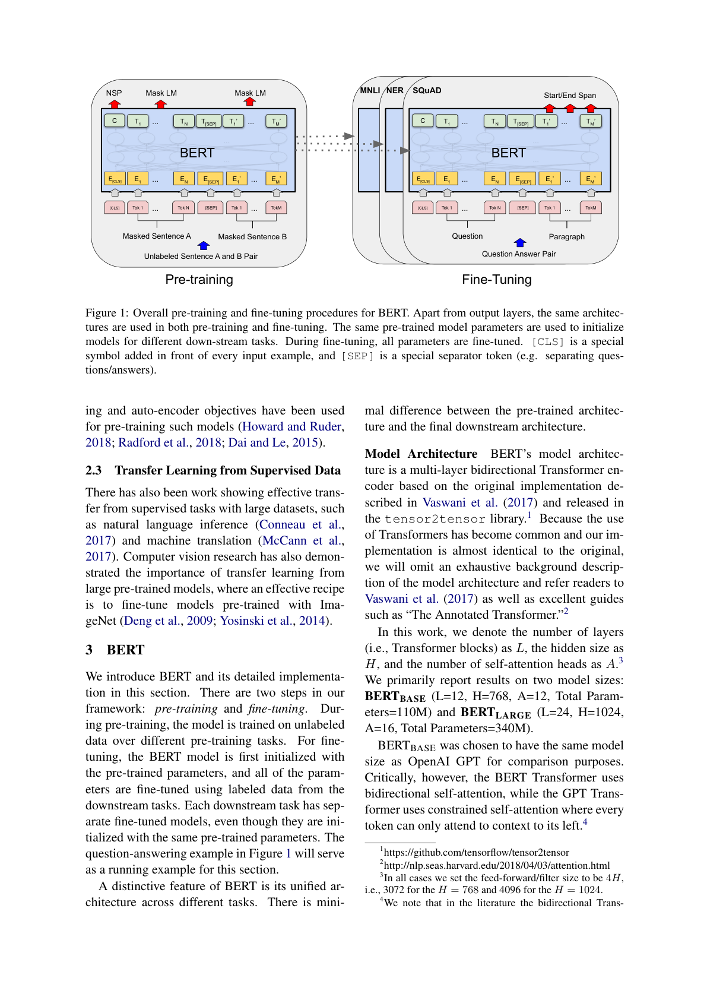
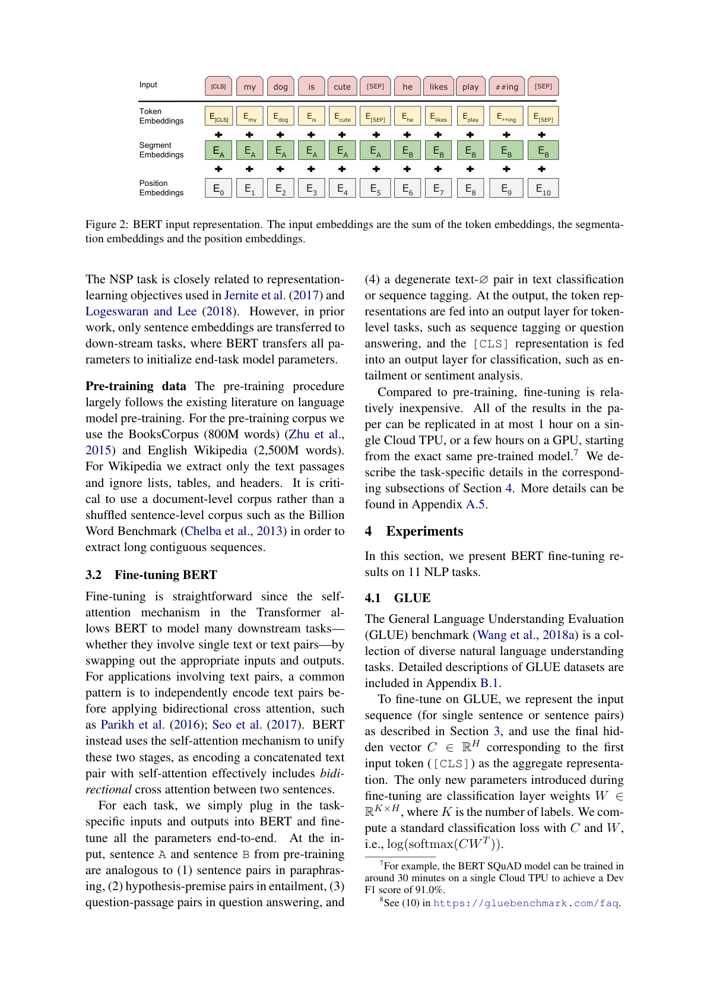
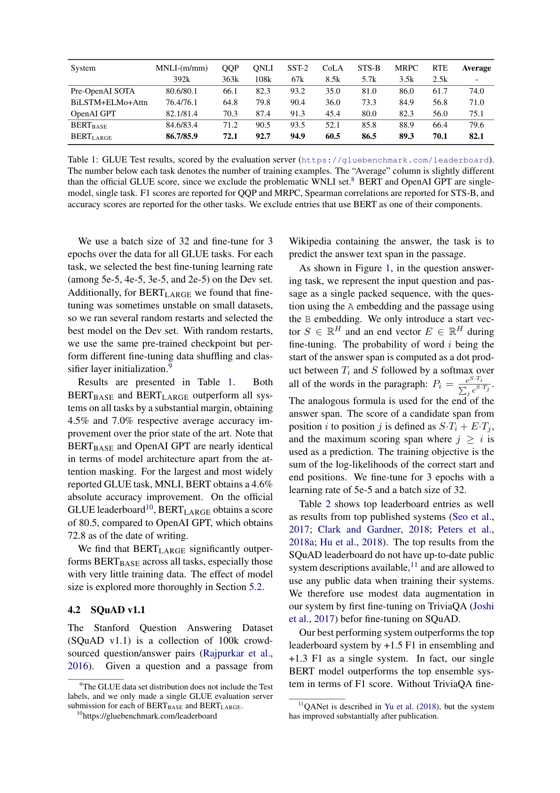
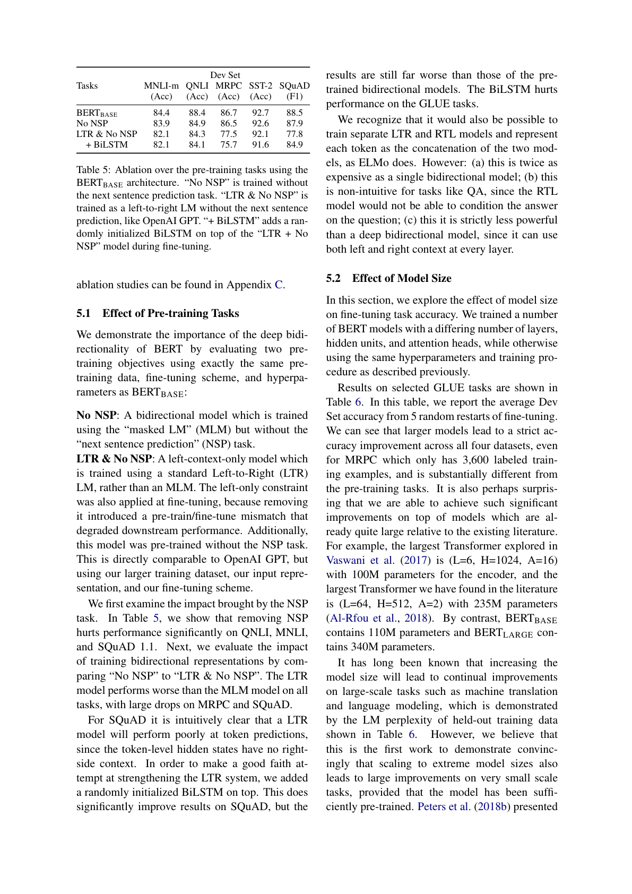
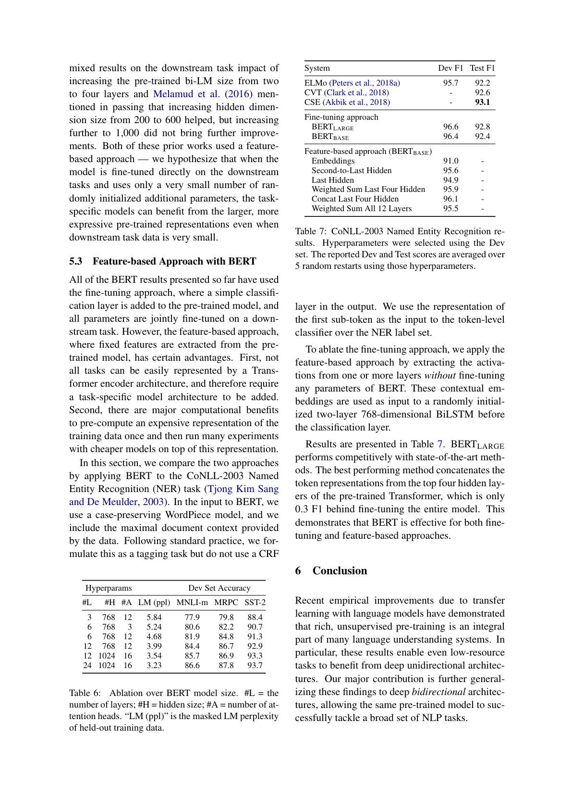
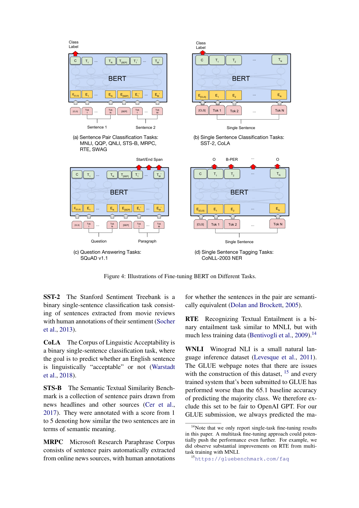

# BERT：用于语言理解的深度双向 Transformer 预训练

Jacob Devlin，Ming-Wei Chang，Kenton Lee，Kristina Toutanova  
Google AI Language  
{jacobdevlin, mingweichang, kentonl, kristout}@google.com

原论文：`arXiv:1810.04805v2 [cs.CL] 24 May 2019`

## 摘要

我们提出了一种新的语言表示模型，称为 BERT，其全称为来自 Transformer 的双向编码器表示（Bidirectional Encoder Representations from Transformers）。不同于近期的语言表示模型（Peters et al., 2018a；Radford et al., 2018），BERT 被设计为通过在所有层中联合利用左上下文和右上下文，从无标注文本中预训练深度双向表示。因此，只需增加一个额外的输出层，就可以对预训练好的 BERT 模型进行微调，从而为大范围任务构建最先进的模型，例如问答和语言推断，而不需要对任务特定结构做大量修改。

BERT 在概念上很简单，在经验上却很强大。它在 11 项自然语言处理任务上取得了新的最优结果，包括将 GLUE 分数提升到 80.5%（绝对提升 7.7 个百分点），将 MultiNLI 准确率提升到 86.7%（绝对提升 4.6 个百分点），将 SQuAD v1.1 问答测试集 F1 提升到 93.2（绝对提升 1.5 个点），并将 SQuAD v2.0 测试集 F1 提升到 83.1（绝对提升 5.1 个点）。

## 1 引言

语言模型预训练已被证明对提升许多自然语言处理任务有效（Dai and Le, 2015；Peters et al., 2018a；Radford et al., 2018；Howard and Ruder, 2018）。这些任务既包括句子级任务，例如自然语言推断（Bowman et al., 2015；Williams et al., 2018）和释义判定（Dolan and Brockett, 2005），其目标是通过整体分析句子来预测句间关系；也包括词元级任务，例如命名实体识别和问答，在这类任务中模型需要在词元级别产生细粒度输出（Tjong Kim Sang and De Meulder, 2003；Rajpurkar et al., 2016）。

将预训练语言表示应用到下游任务上，现有主要有两种策略：基于特征的方法和微调方法。基于特征的方法，例如 ELMo（Peters et al., 2018a），使用任务特定架构，并将预训练表示作为附加特征。微调方法，例如生成式预训练 Transformer（OpenAI GPT）（Radford et al., 2018），只引入极少量任务特定参数，并通过对所有预训练参数进行简单微调来在下游任务上训练。这两种方法在预训练期间共享相同的目标函数，即使用单向语言模型学习通用语言表示。

我们认为，当前技术限制了预训练表示的能力，尤其是对微调方法而言。主要限制在于标准语言模型是单向的，这限制了预训练阶段可使用的架构选择。例如在 OpenAI GPT 中，作者使用从左到右的架构，因此在 Transformer（Vaswani et al., 2017）的自注意力层中，每个词元只能关注它前面的词元。这样的约束对句子级任务并不理想；而当把基于微调的方法应用到问答这类词元级任务上时，这种限制甚至可能非常有害，因为这类任务必须同时利用两个方向的上下文。

在本文中，我们通过提出 BERT（来自 Transformer 的双向编码器表示）改进了基于微调的方法。BERT 通过一种“掩码语言模型”（masked language model，MLM）预训练目标来缓解上述单向性约束，这一目标受到完形填空任务（Taylor, 1953）的启发。掩码语言模型会随机遮蔽输入中的一部分词元，其目标是仅根据上下文来预测被遮蔽词元原始的词表 id。与从左到右的语言模型预训练不同，MLM 目标使表示能够融合左上下文和右上下文，从而使我们可以预训练一个深度双向 Transformer。除掩码语言模型之外，我们还使用“下一句预测”（next sentence prediction）任务来联合预训练文本对表示。

本文的贡献如下：

- 我们展示了双向预训练对于语言表示的重要性。不同于 Radford et al. (2018) 使用单向语言模型做预训练，BERT 使用掩码语言模型来获得预训练的深度双向表示。这也不同于 Peters et al. (2018a) 将独立训练的从左到右和从右到左语言模型做浅层拼接。
- 我们表明，预训练表示减少了对大量精细设计的任务特定架构的需求。BERT 是第一个基于微调的表示模型，它在大规模句子级和词元级任务集合上取得了最优性能，超过了许多任务特定架构。
- BERT 将 11 项 NLP 任务的最优结果进一步推进。代码和预训练模型可在 `https://github.com/google-research/bert` 获取。

## 2 相关工作

通用语言表示的预训练有着悠久历史，本节简要回顾最常用的方法。

### 2.1 无监督的基于特征方法

学习广泛适用的词表示数十年来一直是活跃研究方向，既包括非神经方法（Brown et al., 1992；Ando and Zhang, 2005；Blitzer et al., 2006），也包括神经方法（Mikolov et al., 2013；Pennington et al., 2014）。预训练词嵌入已经成为现代 NLP 系统的组成部分，相比从头学习的嵌入，它们带来了显著提升（Turian et al., 2010）。为了预训练词向量，人们使用过从左到右的语言建模目标（Mnih and Hinton, 2009），也使用过区分左右上下文中正确词与错误词的目标（Mikolov et al., 2013）。

这些方法后来被推广到更粗粒度的表示，例如句子嵌入（Kiros et al., 2015；Logeswaran and Lee, 2018）或段落嵌入（Le and Mikolov, 2014）。为了训练句子表示，已有工作使用过对候选下一句进行排序的目标（Jernite et al., 2017；Logeswaran and Lee, 2018），也使用过给定前一句表示、从左到右生成下一句词语的目标（Kiros et al., 2015），或者来源于去噪自编码器的目标（Hill et al., 2016）。

ELMo 及其前身（Peters et al., 2017, 2018a）沿着另一条维度推广了传统词嵌入研究。它们从一个从左到右和一个从右到左的语言模型中提取上下文敏感特征。每个词元的上下文表示是左右两个方向表示的拼接。在将上下文词嵌入与已有任务特定架构结合时，ELMo 在多个主要 NLP 基准上推进了最优结果（Peters et al., 2018a），包括问答（Rajpurkar et al., 2016）、情感分析（Socher et al., 2013）和命名实体识别（Tjong Kim Sang and De Meulder, 2003）。Melamud et al. (2016) 提出通过一个任务来学习上下文表示：使用 LSTM 根据左上下文和右上下文预测单个词。与 ELMo 类似，他们的模型也是基于特征的，而不是深度双向的。Fedus et al. (2018) 表明，完形填空任务可以用来提高文本生成模型的鲁棒性。

### 2.2 无监督微调方法

与基于特征的方法一样，这一方向最早的工作也只是从无标注文本中预训练词嵌入参数（Collobert and Weston, 2008）。

更近的工作则从无标注文本中预训练能够产生上下文化词元表示的句子或文档编码器，并针对有监督下游任务进行微调（Dai and Le, 2015；Howard and Ruder, 2018；Radford et al., 2018）。这类方法的优点是需要从头学习的参数很少。至少在一定程度上也正因为如此，OpenAI GPT（Radford et al., 2018）在 GLUE 基准（Wang et al., 2018a）中的许多句子级任务上取得了当时的最优结果。从左到右语言模型和自编码目标都被用于预训练这类模型（Howard and Ruder, 2018；Radford et al., 2018；Dai and Le, 2015）。

### 2.3 从监督数据中进行迁移学习

还有一些工作表明，从大型监督任务中进行迁移也很有效，例如自然语言推断（Conneau et al., 2017）和机器翻译（McCann et al., 2017）。计算机视觉研究同样证明了从大型预训练模型中迁移学习的重要性，一种有效方案是对使用 ImageNet 预训练的模型进行微调（Deng et al., 2009；Yosinski et al., 2014）。

## 3 BERT

本节介绍 BERT 及其实现细节。我们的框架包括两个阶段：预训练和微调。在预训练阶段，模型在无标注数据上通过不同的预训练任务进行训练。在微调阶段，BERT 模型先用预训练参数初始化，然后使用来自下游任务的标注数据对所有参数进行微调。每个下游任务都有各自独立的微调模型，尽管它们都由同一组预训练参数初始化。图 1 中的问答示例将作为本节的贯穿示例。

BERT 的一个显著特征是它在不同任务上使用统一架构。预训练架构与最终下游架构之间只有极小差异。

### 模型架构

BERT 的模型架构是一个多层双向 Transformer 编码器，基于 Vaswani et al. (2017) 所描述并在 `tensor2tensor` 库中发布的原始实现。由于 Transformer 的使用已很普遍，而且我们的实现与原始版本几乎一致，因此我们不再对模型架构做穷尽式背景介绍，而是将读者引向 Vaswani et al. (2017) 以及诸如 “The Annotated Transformer” 这样的优秀指南。

在本文中，我们用 `L` 表示层数（即 Transformer block 数），`H` 表示隐藏层维度，`A` 表示自注意力头数。我们主要报告两种模型规模的结果：

- `BERTBASE`：`L=12, H=768, A=12, 参数总数=110M`
- `BERTLARGE`：`L=24, H=1024, A=16, 参数总数=340M`

选择 `BERTBASE` 是为了与 OpenAI GPT 保持相同的模型规模，便于比较。关键差异在于，BERT 的 Transformer 使用双向自注意力，而 GPT 的 Transformer 使用受限自注意力，其中每个词元只能关注其左侧上下文。

> 注：在本文所有实验中，前馈层/滤波器大小设为 `4H`，即当 `H=768` 时为 `3072`，当 `H=1024` 时为 `4096`。

### 输入/输出表示

为了让 BERT 能够处理多种下游任务，我们的输入表示能够在一个词元序列中无歧义地表示单句和句对（例如 `<问题, 答案>`）。在本文中，“句子”可以是任意连续文本片段，而不必是真正的语言学句子。“序列”指输入到 BERT 的词元序列，可以是一句话，也可以是打包在一起的两句话。

我们使用 WordPiece 嵌入（Wu et al., 2016），词表大小为 30,000。每个序列的第一个词元始终是一个特殊分类词元 `[CLS]`。与该词元对应的最终隐藏状态将用作分类任务的整体序列表示。句对被打包成一个单独序列。我们通过两种方式区分这两句话。第一，用特殊词元 `[SEP]` 将它们隔开。第二，为每个词元加入一个可学习的嵌入，指示其属于句子 A 还是句子 B。正如图 1 所示，我们用 `E` 表示输入嵌入，用 `C∈R^H` 表示特殊 `[CLS]` 词元的最终隐藏向量，用 `T_i∈R^H` 表示第 `i` 个输入词元的最终隐藏向量。

对于任意词元，它的输入表示由对应的词元嵌入、句段嵌入和位置嵌入相加构成。图 2 给出了这一构造方式的可视化。

图 1：BERT 的整体预训练与微调流程。除输出层外，预训练和微调中使用的是同一套架构。相同的预训练模型参数被用于初始化不同下游任务的模型。在微调期间，所有参数都会被微调。[CLS] 是加在每个输入样本前面的特殊符号，[SEP] 是特殊分隔符词元（例如用于分隔问题/答案）。

### 3.1 预训练 BERT

不同于 Peters et al. (2018a) 和 Radford et al. (2018)，我们不用传统的从左到右或从右到左语言模型来预训练 BERT。相反，我们使用两种无监督任务来预训练 BERT，本节对此进行说明。该步骤对应图 1 的左半部分。

#### 任务 1：掩码语言模型

直觉上，深度双向模型理应比单纯从左到右模型，或者从左到右和从右到左模型的浅层拼接更强。不幸的是，标准条件语言模型只能从左到右或者从右到左训练，因为双向条件会让每个词间接“看到自己”，模型就能在多层上下文中轻易预测目标词。

为了训练深度双向表示，我们只需随机遮蔽输入词元中的一部分，然后预测那些被遮蔽的词元。我们将这一过程称为“掩码语言模型”（MLM）；在文献中它常被称为完形填空任务（Taylor, 1953）。在这种情况下，与掩码词元对应的最终隐藏向量会像标准语言模型一样，被送入一个关于词表的输出 softmax 中。在所有实验中，我们对每个序列中 15% 的 WordPiece 词元进行随机遮蔽。不同于去噪自编码器（Vincent et al., 2008），我们只预测被遮蔽的词，而不是重构整个输入。

尽管这种做法使我们能够得到双向预训练模型，但它也带来一个缺点：预训练和微调之间存在不匹配，因为 `[MASK]` 词元不会出现在微调阶段。为缓解这一点，我们并不总是用真正的 `[MASK]` 词元替换“被遮蔽”的词。训练数据生成器会随机选择 15% 的词元位置作为预测目标。如果第 `i` 个词元被选中，我们就将其替换为：

- 80% 的概率替换成 `[MASK]`
- 10% 的概率替换成随机词元
- 10% 的概率保持原样

然后，`T_i` 将通过交叉熵损失用于预测原始词元。我们在附录 C.2 中比较这一过程的不同变体。

#### 任务 2：下一句预测（NSP）

很多重要的下游任务，如问答（QA）和自然语言推断（NLI），都建立在理解两个句子之间关系的基础上，而语言建模本身并不能直接捕捉这种关系。为了训练能够理解句间关系的模型，我们预训练一个二分类的下一句预测任务，这个任务可以从任意单语语料中轻松构造出来。具体来说，在为每个预训练样本选择句子 A 和句子 B 时，50% 的情况下，B 是 A 后面真正相邻的下一句（标记为 `IsNext`）；另 50% 的情况下，B 是语料中随机选取的一句（标记为 `NotNext`）。如图 1 所示，`C` 被用于下一句预测（NSP）。尽管这个任务很简单，但我们会在第 5.1 节中表明，朝向该任务进行预训练对 QA 和 NLI 都非常有益。

> 最终模型在 NSP 任务上的准确率达到 97% 到 98%。  
> 向量 `C` 如果不经过微调，并不是一个有意义的句子表示，因为它是借助 NSP 训练出来的。

图 2：BERT 输入表示。输入嵌入是词元嵌入、句段嵌入和位置嵌入之和。

#### 预训练数据

预训练过程大体遵循已有的语言模型预训练文献。我们使用 BooksCorpus（8 亿词）（Zhu et al., 2015）和英文 Wikipedia（25 亿词）作为预训练语料。对 Wikipedia，我们只抽取正文段落，忽略列表、表格和标题。为了提取长的连续序列，使用文档级语料而不是像 Billion Word Benchmark（Chelba et al., 2013）那样的打乱后的句子级语料至关重要。

### 3.2 微调 BERT

微调很直接，因为 Transformer 中的自注意力机制让 BERT 能够通过替换适当的输入和输出，对许多下游任务建模，无论这些任务涉及单段文本还是文本对。对于涉及文本对的应用，一种常见模式是在应用双向交叉注意力之前先分别编码两个文本，例如 Parikh et al. (2016) 和 Seo et al. (2017)。BERT 则使用自注意力机制将这两个阶段统一起来，因为对拼接后的文本对进行自注意力编码，实际上就等价于包含了句间的双向交叉注意力。

对每个任务，我们只需将任务特定的输入和输出接到 BERT 上，并进行端到端微调。在输入侧，预训练阶段的句子 A 和句子 B 可以分别类比于：

- 释义任务中的句对
- 蕴含任务中的假设-前提对
- 问答任务中的问题-篇章对
- 文本分类或序列标注中的退化文本-空对

在输出侧，词元表示会送入一个输出层，用于序列标注或问答等词元级任务；而 `[CLS]` 表示会送入输出层，用于蕴含或情感分析等分类任务。

与预训练相比，微调的开销相对较低。本文中的所有结果都可以从完全相同的预训练模型出发，在单个 Cloud TPU 上最多 1 小时内复现，或者在 GPU 上花费数小时复现。第 4 节相应小节描述任务特定细节，更多细节见附录 A.5。

## 4 实验

本节给出 BERT 在 11 项 NLP 任务上的微调结果。

### 4.1 GLUE

通用语言理解评测（GLUE）基准（Wang et al., 2018a）是一个多样化的自然语言理解任务集合。GLUE 数据集的详细说明见附录 B.1。

为了在 GLUE 上微调，我们按第 3 节方式表示输入序列（单句或句对），并使用与第一个输入词元 `[CLS]` 对应的最终隐藏向量 `C∈R^H` 作为整体表示。微调期间唯一新增的参数是分类层权重 `W∈R^{K×H}`，其中 `K` 为标签数量。我们用 `C` 和 `W` 计算标准分类损失，即 `log(softmax(CW^T))`。

我们使用 batch size 32，并对所有 GLUE 任务训练 3 个 epoch。对每个任务，我们在开发集上从 `5e-5, 4e-5, 3e-5, 2e-5` 中选择最佳微调学习率。另外，我们发现 `BERTLARGE` 在小数据集上有时微调不稳定，因此我们进行了数次随机重启，并在开发集上选择最佳模型。随机重启时，我们使用相同的预训练检查点，但采用不同的微调数据打乱方式和分类器层初始化。

表 1：GLUE 测试结果，由评测服务器评分（`https://gluebenchmark.com/leaderboard`）。每个任务下方的数字表示训练样本数。“Average” 列与官方 GLUE 分数略有不同，因为我们排除了有问题的 WNLI 集。BERT 和 OpenAI GPT 都是单模型、单任务。QQP 和 MRPC 报告 F1 分数，STS-B 报告 Spearman 相关系数，其余任务报告准确率。我们排除了那些将 BERT 作为组件之一的条目。

结果见表 1。`BERTBASE` 和 `BERTLARGE` 都在所有任务上以显著优势超过全部系统，平均准确率相较先前最优分别提升了 4.5% 和 7.0%。需要注意的是，`BERTBASE` 与 OpenAI GPT 在模型架构上几乎相同，差别主要在于注意力掩码。对于规模最大、最常被报告的 GLUE 任务 MNLI，BERT 取得了 4.6% 的绝对准确率提升。在写作本文时，官方 GLUE 排行榜上 `BERTLARGE` 得分为 80.5，而 OpenAI GPT 为 72.8。

我们发现 `BERTLARGE` 在所有任务上都明显优于 `BERTBASE`，尤其是在训练数据非常少的任务上。模型规模的影响将在第 5.2 节进一步分析。

### 4.2 SQuAD v1.1

Stanford Question Answering Dataset（SQuAD v1.1）包含 10 万个众包问题/答案对（Rajpurkar et al., 2016）。给定一个问题以及一段包含答案的 Wikipedia 篇章，任务是预测篇章中的答案文本跨度。

如图 1 所示，在问答任务中，我们把输入问题和篇章表示为一个打包后的单序列，其中问题使用 A 嵌入，篇章使用 B 嵌入。微调时我们只引入起始向量 `S∈R^H` 和结束向量 `E∈R^H`。词 `i` 是答案起始位置的概率由 `T_i` 与 `S` 的点积决定，并在篇章中所有词上做 softmax：

`P_i = e^{S·T_i} / Σ_j e^{S·T_j}`

答案结束位置使用类似公式。位置 `i` 到 `j` 的候选跨度分数定义为 `S·T_i + E·T_j`，并以满足 `j ≥ i` 的最高分跨度作为预测结果。训练目标是正确起始位置与结束位置对数似然之和。我们以学习率 `5e-5`、batch size `32` 微调 3 个 epoch。

表 2 展示了排行榜最佳条目以及已发表顶级系统（Seo et al., 2017；Clark and Gardner, 2018；Peters et al., 2018a；Hu et al., 2018）的结果。SQuAD 排行榜顶部结果缺少最新公开系统描述，而且允许在训练中使用任何公开数据。因此，我们在自己的系统中使用了温和的数据增强：先在 TriviaQA（Joshi et al., 2017）上微调，再在 SQuAD 上微调。

我们的最佳系统在集成情况下比榜首系统高 1.5 个 F1 点，单模型情况下高 1.3 个 F1 点。事实上，我们的单个 BERT 模型在 F1 上已经超过了当时排行榜的最佳集成系统。即便不使用 TriviaQA 微调数据，我们也只损失 0.1 到 0.4 的 F1，依然大幅超越所有已有系统。

### 4.3 SQuAD v2.0

SQuAD 2.0 将 SQuAD 1.1 的任务定义扩展为：提供的段落中可能不存在简短答案，这使问题更贴近真实场景。

我们用一种简单方法将 SQuAD v1.1 的 BERT 模型扩展到该任务。我们把没有答案的问题视为其答案跨度的起点和终点都位于 `[CLS]` 词元。答案起点和终点位置的概率空间因此扩展为包含 `[CLS]` 位置。做预测时，我们比较无答案跨度的分数：

`s_null = S·C + E·C`

与最佳非空跨度的分数：

`ŝ_{i,j} = max_{j≥i} S·T_i + E·T_j`

当 `ŝ_{i,j} > s_null + τ` 时，我们预测为非空答案，其中阈值 `τ` 在开发集上选择，以最大化 F1。该模型没有使用 TriviaQA 数据。我们以学习率 `5e-5`、batch size `48` 微调 2 个 epoch。

与先前排行榜条目及已发表顶级工作（Sun et al., 2018；Wang et al., 2018b）的比较见表 3，并排除了将 BERT 用作组件之一的系统。我们观察到，相较此前最佳系统，F1 提升了 5.1。

### 4.4 SWAG

Situations With Adversarial Generations（SWAG）数据集包含 11.3 万个句对补全样本，用于评估具身常识推断（Zellers et al., 2018）。给定一个句子，任务是从四个候选项中选出最合理的续写。

在 SWAG 数据集上微调时，我们构造四个输入序列，每个序列都包含给定句子（句子 A）与一个候选续写（句子 B）的拼接。唯一引入的任务特定参数是一个向量，它与 `[CLS]` 词元表示 `C` 做点积，得到每个候选项的分数，再通过 softmax 归一化。

我们以学习率 `2e-5`、batch size `16` 微调 3 个 epoch。结果见表 4。`BERTLARGE` 相较作者基线 ESIM+ELMo 系统提升了 27.1%，相较 OpenAI GPT 提升了 8.3%。

## 5 消融研究

本节通过对 BERT 若干方面做消融实验，更好地理解这些因素的相对重要性。更多消融研究见附录 C。

### 5.1 预训练任务的影响

我们通过评估两个预训练目标来展示 BERT 深度双向性的价值，这些实验与 `BERTBASE` 使用完全相同的预训练数据、微调方案和超参数：

- `No NSP`：一个双向模型，使用掩码语言模型（MLM）训练，但不使用下一句预测（NSP）任务。
- `LTR & No NSP`：一个只看左上下文的模型，使用标准从左到右（LTR）语言模型而非 MLM 训练。微调时也保留左侧约束，因为去掉它会引入预训练/微调不匹配，进而损害下游性能。此外，该模型预训练时也不包含 NSP。它可直接与 OpenAI GPT 对比，但采用了我们更大的训练数据集、我们的输入表示和我们的微调方案。

我们首先考察 NSP 任务的影响。表 5 表明，去掉 NSP 会显著伤害 QNLI、MNLI 和 SQuAD 1.1 的性能。接着，我们通过比较 `No NSP` 与 `LTR & No NSP` 来评估训练双向表示的影响。LTR 模型在所有任务上都劣于 MLM 模型，并在 MRPC 和 SQuAD 上出现较大下滑。

对 SQuAD 而言，LTR 模型在词元预测上表现糟糕是很直观的，因为词元级隐藏状态没有右侧上下文。为了尽可能公平地增强 LTR 系统，我们在其上方加入一个随机初始化的 BiLSTM。这确实显著提升了 SQuAD 的结果，但依然远逊于预训练的双向模型；而在 GLUE 任务上，BiLSTM 反而损害了性能。

我们也认识到，还可以像 ELMo 那样训练独立的 LTR 和 RTL 模型，并将每个词元表示为两者的拼接。然而：

- 这样比单个双向模型的代价高一倍；
- 对 QA 这类任务并不自然，因为 RTL 模型无法基于问题来条件化答案；
- 它严格弱于深度双向模型，因为深度双向模型在每一层都能同时利用左右上下文。

表 5：使用 `BERTBASE` 架构对预训练任务做消融。“No NSP” 表示不使用下一句预测任务训练；“LTR & No NSP” 表示像 OpenAI GPT 一样，训练一个没有 NSP 的从左到右语言模型；“+ BiLSTM” 表示在微调期间，在 “LTR + No NSP” 模型上方再加一个随机初始化的 BiLSTM。

### 5.2 模型规模的影响

本节研究模型规模对微调任务准确率的影响。我们训练了一系列 BERT 模型，这些模型的层数、隐藏单元数和注意力头数各不相同，但其他超参数与训练流程保持不变。

选定 GLUE 任务上的结果见表 6。表中报告的是 5 次随机重启微调后开发集准确率的平均值。

我们可以看到，更大的模型会在四个数据集上都带来严格的准确率提升，甚至包括 MRPC 这种只有 3,600 个标注训练样本、且与预训练任务差异很大的数据集。另一个或许令人意外的点是，即便是在相对于已有文献已经相当大的模型上继续扩展，我们仍能获得如此显著的提升。例如，Vaswani et al. (2017) 中探索过的最大 Transformer 是 `(L=6, H=1024, A=16)`，编码器拥有 1 亿参数；而我们在文献中找到的最大 Transformer 是 `(L=64, H=512, A=2)`，参数量 2.35 亿（Al-Rfou et al., 2018）。相比之下，`BERTBASE` 有 1.1 亿参数，`BERTLARGE` 有 3.4 亿参数。

长期以来，人们早已知道，增大模型规模会在机器翻译和语言建模等大规模任务上带来持续改进，这一点也由表 6 中留出训练数据上的语言模型困惑度所展示。然而，我们认为，这是第一项有力表明如下结论的工作：只要模型经过足够充分的预训练，把模型扩展到极大规模也会在非常小规模的任务上带来显著提升。Peters et al. (2018b) 曾报告，将预训练双向语言模型层数从两层增加到四层，对下游任务的影响好坏参半；Melamud et al. (2016) 也顺带提到，将隐藏维度从 200 增加到 600 有帮助，但进一步增至 1000 并未带来额外改进。这两项工作都采用了基于特征的方法。我们的假设是：当模型直接在下游任务上微调，且仅引入非常少量随机初始化附加参数时，即便下游任务数据很少，任务特定模型仍能从更大、更具表达力的预训练表示中受益。

### 5.3 将 BERT 用作基于特征的方法

到目前为止，本文展示的所有 BERT 结果都使用了微调方法，即在预训练模型上添加一个简单分类层，并在下游任务上联合微调全部参数。然而，基于特征的方法，即从预训练模型中抽取固定特征，也有其优势。

第一，并不是所有任务都能轻松表示为 Transformer 编码器架构，因此需要额外加入任务特定模型架构。第二，从计算角度看，也有明显好处：可以先一次性预计算训练数据的昂贵表示，再在其上运行许多更便宜的模型实验。

本节中，我们把 BERT 应用于 CoNLL-2003 命名实体识别（NER）任务（Tjong Kim Sang and De Meulder, 2003），从而比较这两种方法。在输入到 BERT 时，我们使用保留大小写的 WordPiece 模型，并尽量纳入数据中提供的最大文档上下文。按照标准做法，我们把任务表述为标注任务，但在输出中不使用 CRF 层。我们将第一个子词的表示作为词元级分类器的输入，用于预测 NER 标签集合。

为了消融微调方法，我们应用基于特征的方法：从 BERT 的一个或多个层中抽取激活，而不微调 BERT 的任何参数。这些上下文化嵌入被作为一个随机初始化的两层、768 维 BiLSTM 的输入，随后再接分类层。

结果见表 7。`BERTLARGE` 与最先进方法竞争力相当。表现最好的方法是将预训练 Transformer 顶部四层隐藏层中的词元表示进行拼接，这一结果仅比微调整个模型低 0.3 F1。这表明，BERT 对微调方法和基于特征的方法都同样有效。

表 6：BERT 模型规模消融。`#L` 为层数，`#H` 为隐藏维度，`#A` 为注意力头数。`LM (ppl)` 是留出训练数据上的掩码语言模型困惑度。  
表 7：CoNLL-2003 命名实体识别结果。超参数使用开发集选择。开发集和测试集分数是基于这些超参数、5 次随机重启后的平均值。

## 6 结论

近期由语言模型迁移学习带来的经验性提升已经表明，丰富的无监督预训练是许多语言理解系统的核心组成部分。尤其是，这些结果使得即使是低资源任务，也能从深度单向架构中获益。我们的主要贡献，是将这些发现进一步推广到深度双向架构上，使同一个预训练模型能够成功处理广泛的 NLP 任务集合。

## 附录 A.5：不同任务上的微调示意

不同任务上对 BERT 进行微调的示意图见图 4。我们的任务特定模型是通过在 BERT 基础上增加一个输出层形成的，因此需要从头学习的参数数量极少。在这些任务中，(a) 和 (b) 属于序列级任务，(c) 和 (d) 属于词元级任务。图中，`E` 表示输入嵌入，`T_i` 表示词元 `i` 的上下文化表示，[CLS] 是用于分类输出的特殊符号，[SEP] 是用于分隔非连续词元序列的特殊符号。

图 4：在不同任务上微调 BERT 的示意图。

## 附录 B：实验设置细节

### B.1 GLUE 基准实验的详细说明

表 1 中的 GLUE 结果来自：

- `https://gluebenchmark.com/leaderboard`
- `https://blog.openai.com/language-unsupervised`

GLUE 基准包括以下数据集，其描述最初总结自 Wang et al. (2018a)：

- `MNLI`：Multi-Genre Natural Language Inference，是一个大规模众包蕴含分类任务（Williams et al., 2018）。给定一对句子，目标是预测第二句相对于第一句是蕴含、矛盾还是中立。
- `QQP`：Quora Question Pairs，是一个二分类任务，目标是判断 Quora 上提出的两个问题在语义上是否等价（Chen et al., 2018）。
- `QNLI`：Question Natural Language Inference，是 Stanford Question Answering Dataset（Rajpurkar et al., 2016）的一个变体，它被转换成了二分类任务（Wang et al., 2018a）。正样本是包含正确答案的（问题，句子）对，负样本则是来自同一段落、但不包含答案的（问题，句子）对。
- `SST-2`：Stanford Sentiment Treebank，是一个二分类单句分类任务，由电影评论中抽取的句子组成，并带有人类标注的情感标签（Socher et al., 2013）。
- `CoLA`：Corpus of Linguistic Acceptability，是一个二分类单句分类任务，目标是预测一个英文句子在语言学上是否“可接受”（Warstadt et al., 2018）。
- `STS-B`：Semantic Textual Similarity Benchmark，是一个句对集合，数据来自新闻标题及其他来源（Cer et al., 2017）。每对句子都被标注了 1 到 5 的分数，表示二者在语义上的相似程度。
- `MRPC`：Microsoft Research Paraphrase Corpus，由自动从在线新闻来源抽取的句对构成，并由人工标注该句对中的两句在语义上是否等价（Dolan and Brockett, 2005）。
- `RTE`：Recognizing Textual Entailment，是一个与 MNLI 类似的二分类蕴含任务，但训练数据少得多（Bentivogli et al., 2009）。
- `WNLI`：Winograd NLI，是一个小型自然语言推断数据集（Levesque et al., 2011）。

GLUE 网页指出该数据集的构造存在问题，而且所有提交到 GLUE 的已训练系统，其表现都差于简单预测多数类时的 65.1 基线准确率。因此，为了与 OpenAI GPT 公平比较，我们将其排除在外。在我们的 GLUE 提交中，我们始终预测多数类。

> 注：本文只报告单任务微调结果。多任务微调方法有可能将性能进一步推高。例如，我们确实观察到，通过与 MNLI 一起进行多任务训练，RTE 上会有显著提升。

## 附录 C：更多消融研究

### C.1 训练步数的影响

图 5 展示了从预训练 `k` 步之后的检查点开始微调，在 MNLI 开发集上的准确率。这使我们能够回答以下问题：

1. 问题：BERT 是否真的需要如此大量的预训练（`128,000 words/batch * 1,000,000 steps`）才能获得较高微调准确率？  
   回答：是的。与训练 50 万步相比，`BERTBASE` 训练 100 万步时，在 MNLI 上几乎额外获得了 1.0% 的准确率。
2. 问题：由于每个 batch 中只预测 15% 的词，而不是预测每个词，MLM 预训练是否比 LTR 预训练收敛得更慢？  
   回答：MLM 模型的收敛确实比 LTR 模型略慢一些。然而从绝对准确率来看，MLM 模型几乎从一开始就优于 LTR 模型。

图 5：训练步数的消融。图中展示了在微调之后的 MNLI 准确率，起点是已经预训练了 `k` 步的模型参数。横轴为 `k` 的取值。

### C.2 不同掩码策略的消融

在第 3.1 节中，我们提到，当使用掩码语言模型（MLM）目标做预训练时，BERT 对目标词元采用混合掩码策略。下面的消融研究用于评估不同掩码策略的影响。

需要注意，设计这些掩码策略的目的是减小预训练与微调之间的不匹配，因为 `[MASK]` 符号在微调阶段从不出现。我们同时报告 MNLI 和 NER 的开发集结果。对于 NER，我们同时报告微调方法和基于特征的方法，因为我们预期在基于特征方法中，这种不匹配会被放大，因为模型没有机会去调整其表示。

表 8：不同掩码策略的消融。

| 掩码策略比例 | MNLI | NER 微调 | NER 基于特征 |
| --- | ---: | ---: | ---: |
| `MASK 80% / SAME 10% / RND 10%` | 84.2 | 95.4 | 94.9 |
| `MASK 100% / SAME 0% / RND 0%` | 84.3 | 94.9 | 94.0 |
| `MASK 80% / SAME 0% / RND 20%` | 84.1 | 95.2 | 94.6 |
| `MASK 80% / SAME 20% / RND 0%` | 84.4 | 95.2 | 94.7 |
| `MASK 0% / SAME 20% / RND 80%` | 83.7 | 94.8 | 94.6 |
| `MASK 0% / SAME 0% / RND 100%` | 83.6 | 94.9 | 94.6 |

在表中，`MASK` 表示在 MLM 中用 `[MASK]` 符号替换目标词元；`SAME` 表示保持目标词元不变；`RND` 表示用另一个随机词元替换目标词元。

表格左侧的数字表示在 MLM 预训练期间采用各策略的概率（BERT 使用的是 `80%, 10%, 10%`）。右侧表示开发集结果。对于基于特征的方法，我们将 BERT 最后 4 层进行拼接作为特征，这在第 5.3 节中被证明是最优方法。

从表中可以看出，微调对于不同掩码策略表现出令人意外的鲁棒性。不过，正如预期的那样，当把基于特征的方法应用到 NER 时，只使用 `MASK` 策略是有问题的。有意思的是，只使用 `RND` 策略的表现也明显差于我们的策略。

## 参考文献

参考文献过长，本文保留论文原始文献指向与作者-年份引用形式；正文中的所有引文均与原论文一致。若你要，我可以继续把参考文献逐条完整翻成中文并补到本文末尾。
