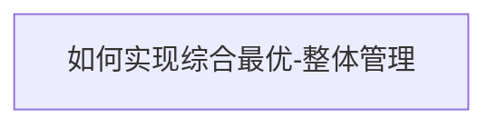
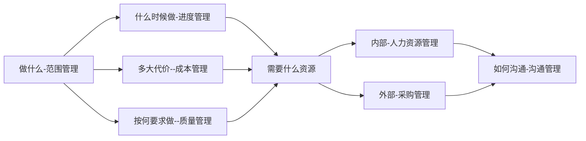
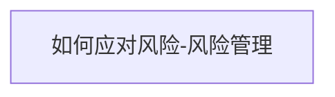

# 3.整体管理

## 3.1 制定项目章程

|管理过程|输入|工具和技术|输出|
|--|--|--|--|
|制定项目章程|1.项目工作说明书   2.商业论证   3.协议  4.事业环境因素  5.组织过程资产 | 1.专家判断    2.引导技术 | 1.项目章程 |

### 项目章程

项目章程是一个很重要的文件，此文件正式表明项目发起方和项目承建方之间的伙伴关系，其中记录了干系人的需要和初步的要求，其中很重要的内容是任命项目经理并对其授权（职责和权力）

#### 项目章程的作用

- 正式确认项目的存在
- 签字后的项目章程，标志着项目的正式启动
- 任命项目经理，给项目经理授权
- 明确了项目的粗略要求
- 把项目与公司的日常运作联系起来
- 多阶段项目中需要项目章程来正式启动一个新阶段

#### 项目章程的内容

- 项目目的或批准项目的原因（项目从哪里来）
- 可测量的项目目标和相关的成功标准（项目到哪去）
- 概括性的项目描述（初步的范围）
- 项目的总体要求（初步的质量）
- 项目的主要风险（主要的风险）
- 总体里程碑进度计划（初步的进度）
- 总体预算（初步投资）
- 项目审批要求
- 委派的项目经理及其职责和职权（委任）
- 发起人或其他批准项目章程的人员的姓名和职权（投资人）

#### 工作说明书

工作说明书和描述项目提供的产品或服务的文字说明。

- 业务需求
- 产品范围说明书
- 战略计划

## 3.2 制定项目管理计划

|管理过程|输入|工具和技术|输出|
|--|--|--|--|
|制定项目管理计划|1.项目章程   2.其他过程的输出  3.事业环境因素  4.组织过程资产 | 1.专家判断    2.引导技术 | 1.项目管理计划 |

### 项目计划编制工作流程

1. 明确目标
2. 成立初步的项目团队
3. 工作准备与信息收集
4. 依据模板、标准编写初步的概要项目计划
5. 把上述计划纳入项目计划，然后对项目计划进行平衡、优化
6. 项目经理负责组织编写项目计划
7. 评审与批准项目计划
8. 获得批准后的项目计划就是项目的基准计划

### 基准的概念

- 项目管理计划一旦被确定下来，成为基准，就只有在提出变更请求并经实施整体变更控制过程批准后，才能变更
- 基准是经过批准的、高层次的项目计划，以便作为比较的基础。基准是一种特殊版本的项目计划
- 项目基准包括：**进度基准、成本基准、范围基准**，也是绩效测量的基准

## 3.3 指导与管理项目执行

## 3.4 监控项目工作

## 3.5 实施整体变更控制

## 3.6 结束项目或阶段
