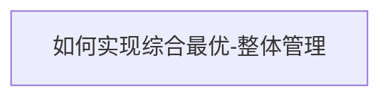
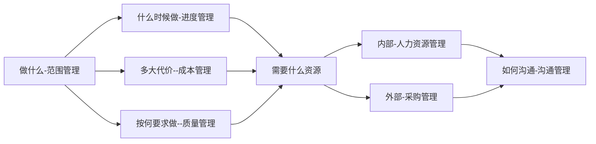
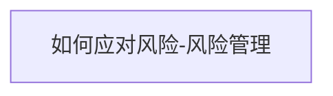

# 3.整体管理

```mermaid
graph TB;

A[如何实现综合最优-整体管理]
```

```mermaid
graph LR;

A[做什么-范围管理] --> B[什么时候做-进度管理] & C[多大代价--成本管理] & D[按何要求做--质量管理]

B & C & D --> E[需要什么资源]

E --> F[内部-人力资源管理] & G[外部-采购管理]

F & G --> H[如何沟通-沟通管理]

```

```mermaid
graph TB;

A[如何应对风险-风险管理]
```
