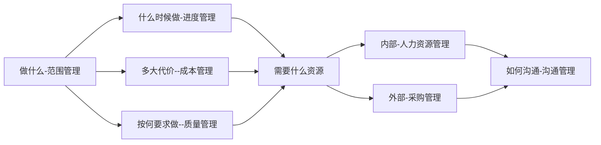
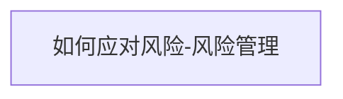
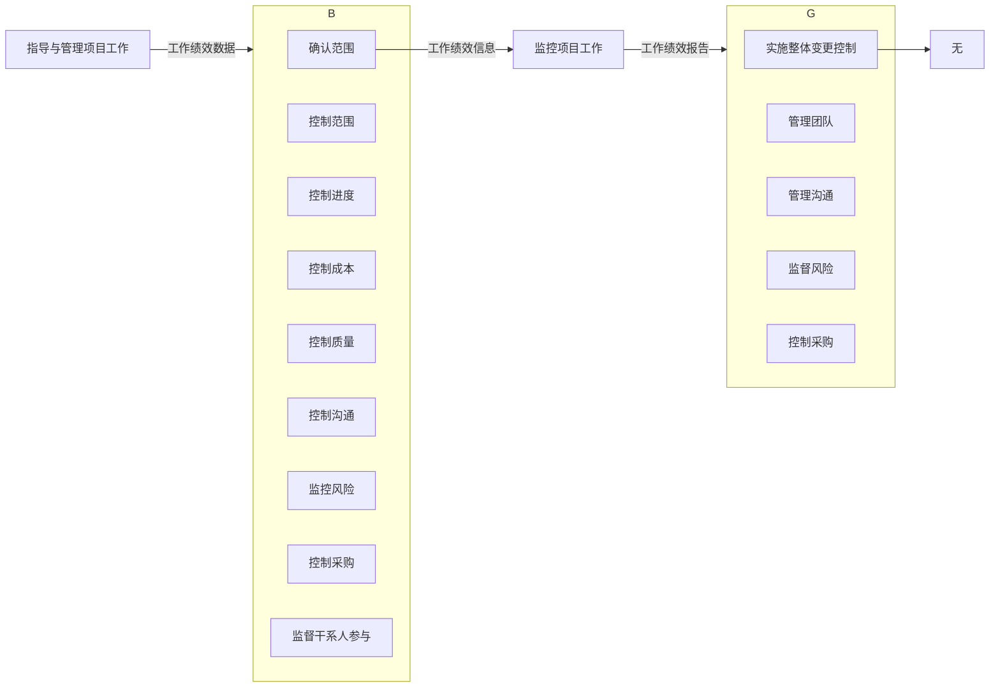
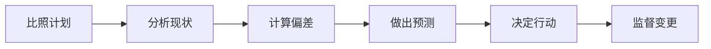
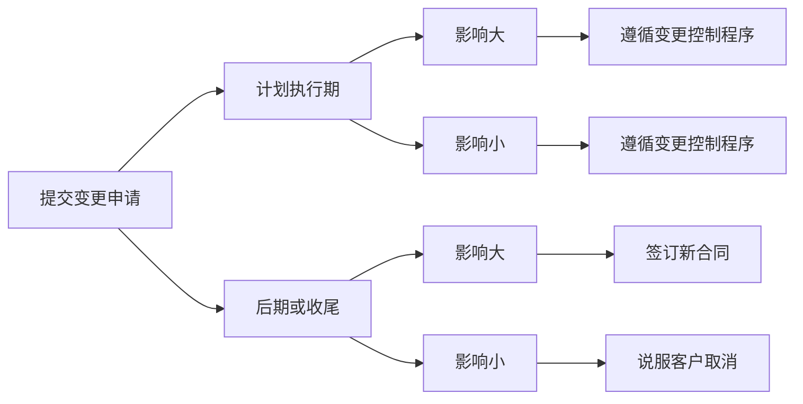

# 3.整体管理






## 3.1 制定项目章程

|管理过程|输入|工具和技术|输出|
|--|--|--|--|
|制定项目章程|1.项目工作说明书 <br/> 2.商业论证 <br/> 3.协议 <br/>4.事业环境因素 <br/>5.组织过程资产 | 1.专家判断  <br/> 2.引导技术 | 1.项目章程 |

### 项目章程

项目章程是一个很重要的文件，此文件正式表明项目发起方和项目承建方之间的伙伴关系，其中记录了干系人的需要和初步的要求，其中很重要的内容是任命项目经理并对其授权（职责和权力）

#### 项目章程的作用

- 正式确认项目的存在
- 签字后的项目章程，标志着项目的正式启动
- 任命项目经理，给项目经理授权
- 明确了项目的粗略要求
- 把项目与公司的日常运作联系起来
- 多阶段项目中需要项目章程来正式启动一个新阶段

#### 项目章程的内容

- 项目目的或批准项目的原因（项目从哪里来）
- 可测量的项目目标和相关的成功标准（项目到哪去）
- 概括性的项目描述（初步的范围）
- 项目的总体要求（初步的质量）
- 项目的主要风险（主要的风险）
- 总体里程碑进度计划（初步的进度）
- 总体预算（初步投资）
- 项目审批要求
- 委派的项目经理及其职责和职权（委任）
- 发起人或其他批准项目章程的人员的姓名和职权（投资人）

#### 工作说明书

工作说明书和描述项目提供的产品或服务的文字说明。

- 业务需求
- 产品范围说明书
- 战略计划

## 3.2 制定项目管理计划

|管理过程|输入|工具和技术|输出|
|--|--|--|--|
|制定项目管理计划|1.项目章程 <br/> 2.其他过程的输出 <br/>3.事业环境因素 <br/>4.组织过程资产 | 1.专家判断  <br/> 2.引导技术 | 1.项目管理计划 |

### 项目计划编制工作流程

1. 明确目标
2. 成立初步的项目团队
3. 工作准备与信息收集
4. 依据模板、标准编写初步的概要项目计划
5. 把上述计划纳入项目计划，然后对项目计划进行平衡、优化
6. 项目经理负责组织编写项目计划
7. 评审与批准项目计划
8. 获得批准后的项目计划就是项目的基准计划

### 基准的概念

- 项目管理计划一旦被确定下来，成为基准，就只有在提出变更请求并经实施整体变更控制过程批准后，才能变更
- 基准是经过批准的、高层次的项目计划，以便作为比较的基础。基准是一种特殊版本的项目计划
- 项目基准包括：**进度基准、成本基准、范围基准**，也是绩效测量的基准

## 3.3 指导与管理项目执行

|管理过程|输入|工具和技术|输出|
|--|--|--|--|
|指导与管理项目执行|1.项目管理计划 <br/> 2.批准的变更请求 <br/>3.事业环境因素 <br/>4.组织过程资产 | 1.专家判断  <br/> 2.项目管理信息系统 <br/> 3.会议 | 1.可交付成果 <br> 2.工作绩效数据 <br>3.变更请求 <br>4.项目管理计划更新 <br>5.项目文件更新 |

### 具体活动包括（但不限于）

- 开展活动来实现项目要求
- 创造项目的可交付成果
- 配备、培训和管理项目团队成员
- 获取、管理和使用资源，包括材料、工具、设备和设施
- 执行已计划好的方法和标准
- 建立并管理项目团队内外的项目沟通渠道
- 生成项目数据（如成本、进度、技术和质量紧张情况，以及状态数据），为预测提供基础
- 提出变更请求，并根据项目范围、计划和环境来实施批准的变更
- 管理风险并实施风险应对活动
- 管理卖方和供应商
- 收集和记录经验教训，并实施批准的过程改进活动

#### 会议

会议是指导与管理项目工作、监控项目工作、实施整体变更控制和结束项目或阶段的工具。

## 3.4 监控项目工作

|管理过程|输入|工具和技术|输出|
|--|--|--|--|
|监控项目工作|1.项目管理计划 <br/> 2.进度预测 <br/>3. 成本预测 <br/> 4.确认的变更 <br/> 5.工作绩效信息 <br/>6.事业环境因素 <br/>7.组织过程资产 | 1.专家判断  <br/> 2.分析技术 <br/>3.项目管理信息系统 <br/> 4.会议 | 1.变更请求 <br> 2.工作绩效报告 <br>3.项目管理计划更新 <br>4.项目文件更新 |

- 监控是贯穿与整个项目的项目管理活动之一
- 包括收集、测量和发布绩效信息，分析测量结果和预测趋势，以便推动过程改进
- 持续的监控是项目管理团队能洞察项目的健康情况，并识别须特别关注的任何方面

### 数据线



### 分析技术

- 回归分析
- 分组分析
- 因果分析，又称鱼刺图、鱼骨图
- 根本原因分析：一项结构化的问题处理法，常用的工具：因果图、头脑风暴法、因果分析
- 预测方法：假设情景分析，蒙特卡洛分析
- 失效模式与影响分析
- 故障树分析
- 储备分析
- 趋势分析：又称趋势预测法，包括趋势平均法、指数平滑法、直线趋势法、非直线趋势法
- 挣值管理

## 3.5 实施整体变更控制

|管理过程|输入|工具和技术|输出|
|--|--|--|--|
|实施整体变更控制|1.项目管理计划 <br/> 2.变更请求 <br/>3.工作绩效报告<br/>4.事业环境因素 <br/>5.组织过程资产 | 1.专家判断  <br/> 2.变更控制工具 <br/> 3.会议 | 1.批准变更请求 <br> 2.变更日志 <br>3.项目管理计划更新 <br>4.项目文件更新 |

### 整体变更控制



#### 项目变更

项目变更是指在信息系统项目的实施过程中，由于项目环境或者其他原因而对项目产品的功能、性能、架构、技术指标、集成方法、项目的范围基准、进度基准和成本基准等方面做出的变更。

#### 项目变更控制委员会（CCB）

是决策机构，不是作业机构。通常，CCB的工作是通过评审手段来决定项目是否变更，但不提出变更方案。

#### 变更应对分析



#### 变更控制流程图

```flow
flowchat
st=>start: 开始
op1=>operation: 1.产生变更想法
op2=>operation: 2.PM和团队分析影响
cn3=>condition: 3.将评估结果通知变更发起人(客户)
tp1=>operation: 修改意见
cn4=>condition: 4.CCB审批
cn5=>condition: 提出修改意见
op5=>operation: 5.执行变更
op6=>operation: 6.记录变更和实施情况
op7=>operation: 7.分发新文档
ed=>end: 结束

st->op1->op2->cn3
cn3(no)->tp1(right)->op2
cn3(yes)->cn4
cn4(no)->cn5
cn5(no)->ed
cn5(yes,top)->op2
cn4(yes)->op5->op6->op7
op7->ed

```

#### 变更请求

并更请求是关于修改任何文档、可交付成果或基准的正式提议。
并更请求可能包括：纠正措施、预防措施、缺陷补救、更新。

#### 批准的变更请求

批准的变更请求是实施整体变更控制过程的输出，包括那些变更控制委员会审查和批准的变更请求。批准的变更请求可能是纠正措施、预防措施或缺陷补救。项目团队把批准的变更请求列入进度计划并付诸实施。

#### 确认的变更

批准的变更是实施整体变更控制的结果，需要对他们的执行情况进行确认，以保证他们都得到正确的落实。确认的变更用数据说明变更已得到正确落实。确认的变更，对变更或补救过的对象进行检查，做出接受或拒绝的决定，并把决定通知干系人。被拒绝的对象可能需要返工。

## 3.6 结束项目或阶段

|管理过程|输入|工具和技术|输出|
|--|--|--|--|
|结束项目或阶段|1.项目管理计划 <br/> 2.验收的可交付成功 <br/>3.组织过程资产 | 1.专家判断  <br/> 2.分析技术 <br/> 3.会议 | 1.最终产品、服务或成果 <br> 2.组织过程资产更新 |

### 合同收尾VS行政收尾

**合同收尾**是在合同双方实质性履行完合同规定的权力和义务后对单个合同进行正式关门。
**行政收尾**是项目实质性完工以后对项目进行正式关门。

合同收尾外部，行政收尾内部
合同收尾在前，行政收尾在后
合同收尾一次，行政收尾多次

#### 联系

- 都需要进行产品核实
- 都需要总结经验教训
- 对相关资料进行整理和归档
- 更新组织过程资产

#### 区别

- 行政收尾针对项目和项目各阶段，每个项目阶段结束都需要进行；而合同收尾针对合同，一个合同只需要一次
- 从整个项目来说合同收尾在行政收尾之前
- 从某一合同来说，合同收尾包括行政收尾
- 行政收尾由项目发起人或高层给项目经理签发项目阶段结束或整体结束的上面确认；而合同收尾由采购管理成员向卖方签发合同结束的书面确认书。
