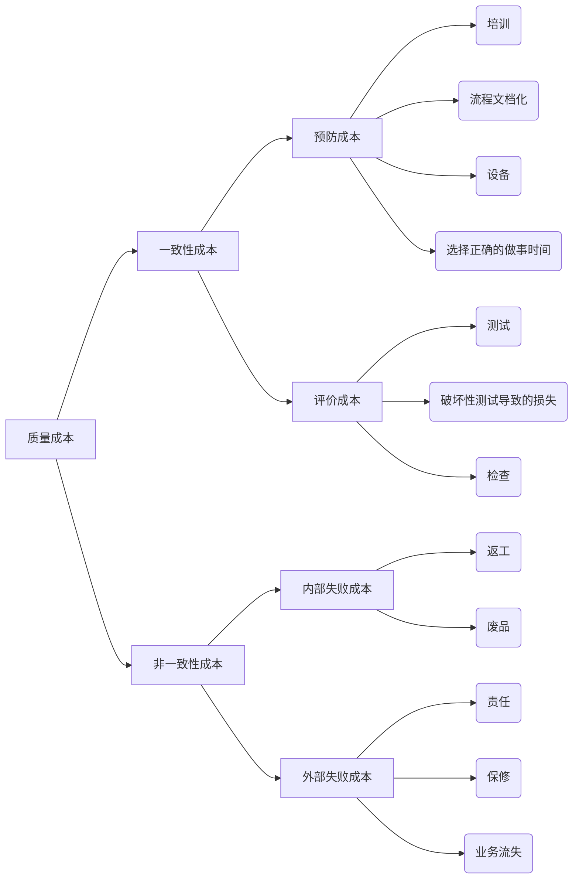

# 7. 质量管理

## 7.1 质量管理总线索

### 质量定义

**质量**：过程、产品或服务满足明确的需求能力的特征。 --美国质量管理协会
**质量管理**：就是确定和建立质量方针、质量目标及职责，并在质量体系中通过质量策划、质量控制、质量保证和质量改进等手段来实施全部质量管理职能的所有活动。
**项目质量管理**：执行组织确定质量政策、目标与职责的各过程和活动，从而使得项目满足其预定的需求。

质量时唯一不可妥协的事情。

### 质量管理八项原则

- 以顾客为中心
- 领导作用
- 全员参与
- 过程方法
- 管理的系统方法
- 持续改进
- 基于事实的决策方法
- 与供方互利的关系

### 全面质量管理

**全面质量管理**以全过程、全员参与、全面方法的质量管理(科学的管理方法，数理统计、电子技术，通信技术等)、全面结果质量管理(产品质量/工作质量/工程质量/服务质量)，让顾客满意，永续经营。

四个核心特征：

- 全员参与的质量管理
- 全过程的质量管理
- 全面方法的质量管理
- 全面结果的质量管理

### 六西格玛

### 质量与等级

### 精确度与准确度

**精确度**：重复测量的结果非常聚合，离散度很小
**准确度**：测量值非常接近实际值

### 质量大师观点

PDCA戴明环，Plan -> Do -> Check -> Action

朱兰，质量三部曲：质量计划-质量控制-质量改进

克劳士比：零缺陷

田口玄一：质量是设计出来的

## 7.2 规划质量管理

|管理过程|输入|工具和技术|输出|
|--|--|--|--|
|规划质量管理|1.项目管理计划  2.干系人登记册 3.风险登记册 4.需求文件   5.组织过程资产 6.事业环境因素 | 1.成本绩效分析 2.质量成本  3.七种基本质量工具   4.标杆对照  5.实验设计 6.统计抽样  7.其他质量规划工具  8.会议 | 1.质量管理计划  2.过程改进计划  3.质量测量指标   4.质量核对单   5.项目文件更新|

**质量管理计划**：质量管理计划是项目管理计划的组成部分，描述如何实施组织的质量政策，以及项目管理团队准备如何达到项目的质量要求。质量管理计划可以是正式的，也可以是非正式的，可以是非常详细的，也可以是高度概括的。应该在项目早期就对质量管理计划进行评审，以确保决策是基于准确信息的。这样做的好处是，更加关注项目的价值定位，降低因返工而造成的成本超支或进度延误。

**过程改进计划**：过程改进计划详细说明项目管理过程和产品开发过程进行分析的各个步骤，以识别增值活动。需要考虑过程边界、过程配置、过程测量指标、绩效改进目标。

**质量核对单**：质量核对单是一种结构化工具，通常具体列出各项内容，用来核实所要求的一系列步骤是否已得到执行。质量核对单应该涵盖在范围基准中定义的验收标准。

**质量测量指标**：质量测量指标专用于描述项目或产品属性，以及控制质量过程将如何对属性进行测量。

### 工具和技术

**成本/效益分析**：满足质量要求主要的回报是更少的返工，而返工的减少意味着生产效率提高费用降低、客户满意度的提高。质量管理方面的成本支出主要与项目质量管理活动相关。质量计划的目标是努力使获得的收益远远超过实施过程中消耗的成本。

**标杆对照**：是将实际或计划的项目实践与可比项目的实践进行对照，以便识别最佳实践，形成改进意见，并为绩效考核提供依据。

**实验设计**：实验设计是一种统计分析手段，可以帮助人们识别并找出哪些变量对项目结果的影响最大。

**统计抽样**：统计抽样是指从目标总体中抽取一部分相关样本用于检查和测量，以满足质量管理计划中的规定。

**质量成本**：质量成本指在产品生命周期中发生的所有成本，包括为预防不符合要求、为评价产品或服务是否符合要求，以及因未达到要求而发生的所有成本。

## 7.3 实施质量保证

|管理过程|输入|工具和技术|输出|
|--|--|--|--|
|实施质量保证|1.质量管理计划  2.过程改进计划 3.质量测量指标 4.质量控制测量结果   5.项目文件| 1.质量管理和控制工具（新七和老七种工具）   2.质量审计  3.过程分析 | 1.变更请求  2.项目管理计划更新  3.项目文件更新   4.组织过程资产更新   |

### 质量保证活动

是一项管理职能，包括所有为保证项目能够满足相关的质量标准而建立的活动，一般由质量保证部门或者类似的相关部门完成，应该贯穿与整个项目的生命周期。

|工具和技术|定义|目标|时间点|人|确认作用|
|--|--|--|--|--|--|
|质量审计|又称质量保证体系审核，是对具体质量管理活动的 结构性的评审。|1识别全部正在实施的良好及最佳实践 2.识别全部违规做法、差距及不足 3.分享类似项目的良好实践 4.积极主动提供协助，改进过程的执行 帮助团队提高生产效率 5.每次审计应对组织经验教训的积累做出贡献|可以事先，也可随机|内部审计或第三方机构|可以确认已经批准的变更请求的实施情况|

#### 过程分析

过程分析是按照过程改进计划中概括的步骤来识别所需的改进。它也要检查在过程运行期间遇到的问题、制约因素，以及发现的非增值活动。过程分析包括根本原因分析--用于识别问题、探究根本原因，并指定预防措施的一种具体技术。

#### 老七种工具

**刘英只点脱脂茶**

**流程图**：
**因果图**：又称石川图或鱼刺图
**直方图**：
**散点图**：显示两种质量特性数据之间的关系以及关系密切程度；
**帕累托图**：二八原则
**控制图**：判断生产过程是否处于稳定状态
**检查表**：又称计数表，用于收集数据的查对清单。

- 寻找原因--**因果图、石川图、鱼骨图**
- 引起问题的最大最主要原因，80/20法则--**帕累托图**
- 项目过程是否稳定、是否在可控范围内，项目整体情况--**控制图**
- 过程变量的分布的形状和宽度来确定过程中出现问题的原因--**直方图**
- 以确定两个变量间是否存在可能的联系--**散点图**

## 7.4 控制质量

|管理过程|输入|工具和技术|输出|
|--|--|--|--|
|控制质量|1.项目管理计划  2.质量测量指标 3.质量核对单 4.工作绩效数据   5.批准的变更请求 6.可交付成果  7.项目文件 8.组织过程资产| 1.质量管理和控制工具 （新七和老七种工具）   2.统计抽样  3.检查 | 1.质量控制测量结果  2.确认的变更  3.核实的可交付成果 4.工作绩效信息 5.变更请求 6.项目管理计划更新 7.项目文件更新   8.组织过程资产更新   |

### 质量保证 VS. 质量控制

|质量保证QA|质量控制QC|
|--|--|
|事中"做"质量|事后"控"质量|
|由工作执行者边执行、边开展|由专门质量控制人员在事后开展|
|发现系统原因导致的过程偏差，据此开展过程改进|发现特殊原因导致的过程偏差，并加以纠正|
|预防工作成果的质量缺陷|发现和补救工作成果的质量缺陷|
|从整体着眼的质量管理体系建设|从局部着眼的具体质量问题纠正|
|过程控制、机制建立|成果控制、关注纠偏|

#### 新七种工具

**矩树相亲策动优**

- 矩阵图：
- 树形图：
- 关联图：
- 亲和图：
- 过程决策程序图
- 活动网络图
- 优先矩阵